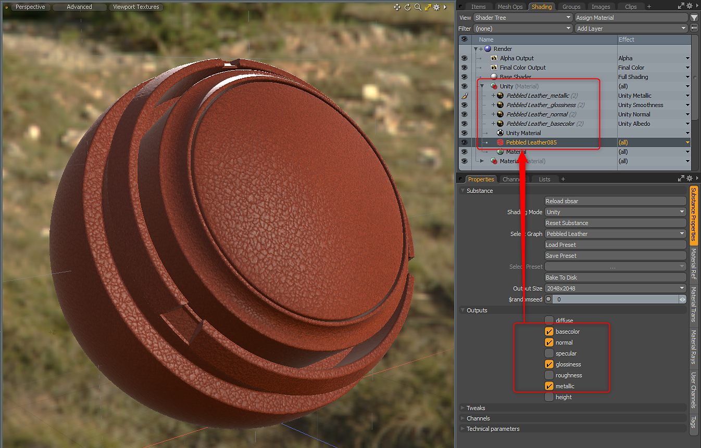
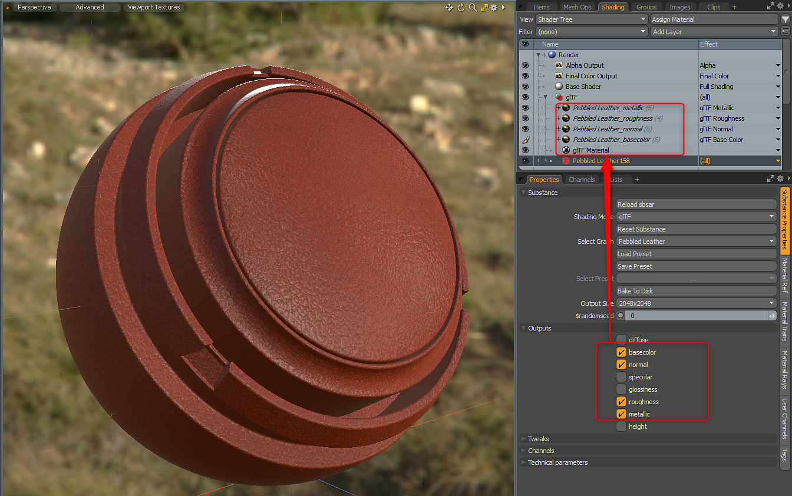

# Custom Materials

The Substance plugin supports the Unreal, Unity and glTF custom materials. Before you load an sbsar file, you can select which shading mode you would like to use.

## Table of Contents

## Unity Material

When using the Unity Material, the Material Layer Effect will be set automatically. The Substance Plugin will place the Unity Material directly above the Substance Item Material.

| Substance Output | Colorspace | Material Layer Effect |
| --- | --- | --- |
| Base Color | sRGB | Unity Albedo |
| Glossiness | Linear | Unity Smoothness |
| Metallic | Linear | Unity Metallic |
| Normal | Linear | Unity Normal |
| Emissive | sRGB | Unity Emission **\*set to sRGB on Image Still** |
| Height | Linear | Unity Bump |
| Ambient Occlusion | Linear | Unity Ambient Occlusion |

{width="600px"}

## Unreal Material

When using the Unreal Material, the Material Layer Effect will be set automatically. The Substance Plugin will place the Unreal Material directly above the Substance Item Material.

| Substance Output | Colorspace | Material Layer Effect |
| --- | --- | --- |
| Base Color | sRGB | Unreal Base Color |
| Roughness | Linear | Unreal Roughness |
| Metallic | Linear | Unreal Metallic |
| Normal | Linear | Unreal Normal |
| Height | Linear | Unreal Bump |
| Emissive | sRGB | Unreal Emissive **\*set to sRGB on Image Still** |
| Ambient Occlusion | Linear | Unreal Ambient Occlusion |
| Opacity | Linear | Unreal Opacity **\*need to uncheck inverted on the Texture Layer** |

{width="600px"}

You may need to invert the normal. You can do this from the Tweaks menu if the Substance has a control for normal orientation. If not, this can be done on the texture itself. For more information, please see the "**[Working with Normals](../working-with-normals/working-with-normals.md)**" page.

## glTF Material

When using the glTF Material, the Material Layer Effect will be set automatically. The Substance Plugin will place the glTF Material directly above the Substance Item Material.

| Substance Output | Colorspace | Material Layer Effect |
| --- | --- | --- |
| Base Color | sRGB | glTF Base Color |
| Roughness | Linear | glTF Roughness |
| Metallic | Linear | glTF Metallic |
| Normal | Linear | glTF Normal |
| Emissive | sRGB | glTF Emissive **\*set to sRGB on Image Still** |
| Ambient Occlusion | Linear | glTF Ambient Occlusion |

{width="600px"}

You may need to invert the normal. You can do this from the Tweaks menu if the Substance has a control for normal orientation. If not, this can be done on the texture itself. For more information, please see the "**[Working with Normals](../working-with-normals/working-with-normals.md)**" page.
