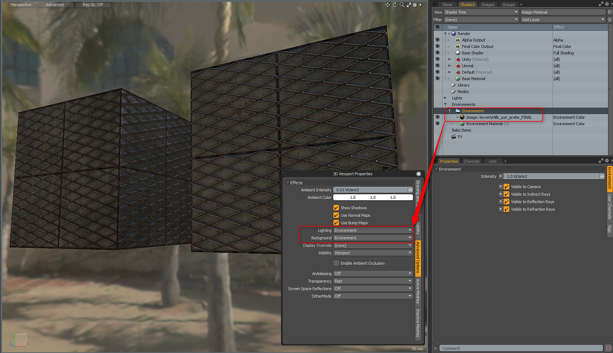
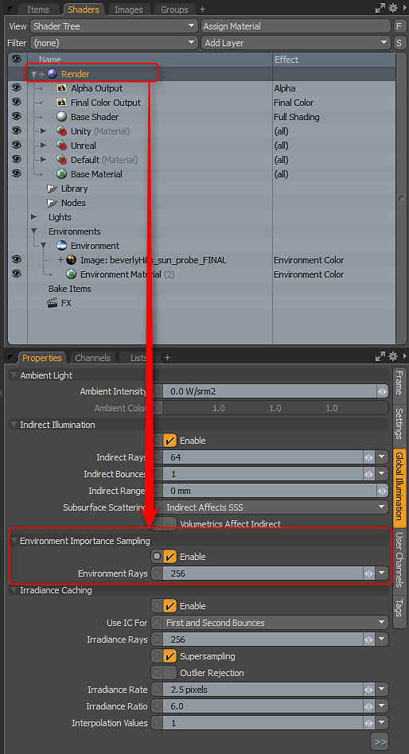

# Environment and Rendering Setup

## Environment Setup and Rendering

For the best results with physically-based rendering and Advanced Viewport setup, you need to use an HDR map in the Environment. MODO ships with several Environment presets that can be found in the Layout Tab.   
Once you have an HDR environment loaded, you need to set the Advanced Viewport Lighting and Background options. You can hit the O key to bring up the 3D Viewport Properties and in the Advanced Options, set the  
Lighting and Environment to the Environment option. Alternatively, you can use Scene + Environment for the Lighting if you have scene lights.

## Importance Sampling

The Substance Designer 3D viewport uses importance sampling. For the best results when rendering, you should enable Importance Sampling for the MODO renderer. You can do this on the Global Illumination tab of the Render Settings.

