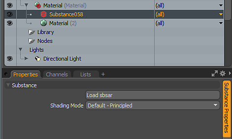
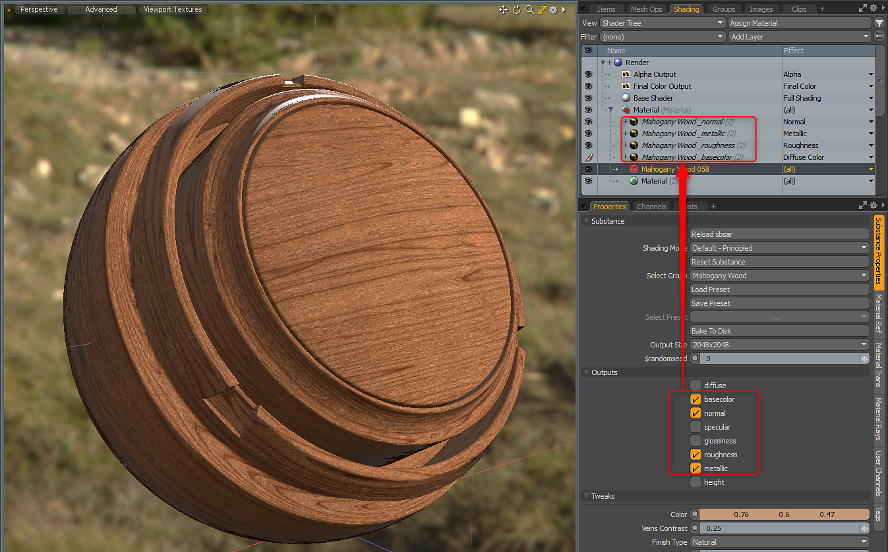
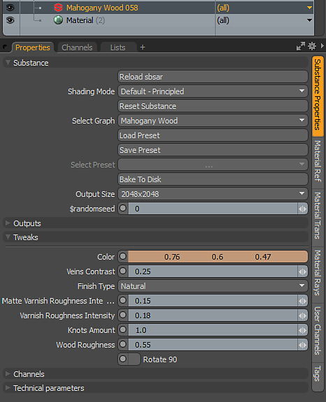

# Substance in MODO Overview

## Overview:

## Opening a Substance

1. Create a material or select a material group.
1. Under Texture&gt;Substance, choose create Substance or use the Create button under the Substance Kit options. This will create a Substance material in the shader tree.
1. Click the Load sbsar to load an sbsar file.

   

## Creating Outputs

Using the **Default - Principled Shading Mode**, you can create outputs using the metallic/roughness workflow.

1. In the Outputs section of the Substance Properties, click the outputs needed for shading. The Substance texture will be generated, added to the Shader Tree with the correct Material Layer Effect. For Principled Shading Mode, you will need the following:

   | Substance Output | Colorspace | Material Layer Effect (Principled Shading Mode) |
   | --- | --- | --- |
   | Base Color | sRGB | Diffuse Color |
   | Normal | Linear | Normal |
   | Roughness | Linear | Roughness |
   | Metallic | Linear | Metallic |

   

## Changing Resolution/Parameters

You can change Substance parameters to update or change the generated textures. Changing a parameter will cause the Substance Engine to recompute the textures that are fed into the MODO material.

1. Go to the Substance Properties for the Substance Material and in the Tweaks section, change any of the parameters.

   
1. You can change the resolution of the generated textures using the Output Size drop down menu. Substances can be set to generate up to 8K. The [Substance GPU engine](../modo-switch-engine/modo-switch-engine.md) is required for 8K output.
