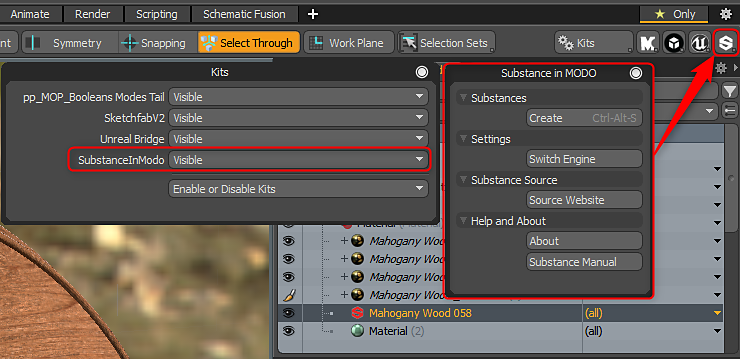

# Modo Installation

To install the plugin, simply drag the LPK file into MODO. If you haven't installed a kit or the MODO content pack, you may be presented with a dialog asking you to create the appropriate folders. Once the kit is installed, you will see a Substance button at the top right of the MODO UI.

