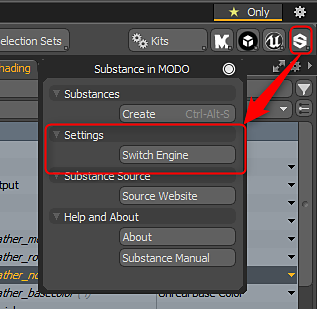

# Modo Switch Engine

## Switching Substance Engine

There are two versions of the Substance Engine, the CPU and the GPU. The GPU engine is used to create textures higher than 2K. The CPU engine is only capable of generating textures up to 2K. If you need higher resolution textures, you need to switch to the GPU engine.

Go to the Substance Settings option in the Substance Kit menu and choose Switch Substance Engine. You will need to restart MODO for the GPU engine to become enabled. This setting acts a global preference. The GPU engine will then be enabled each time you run MODO until it is manually switched.

>[!NOTE]
>
> **Using the Substance GPU engine requires a GPU with dedicated video ram at 1GB or higher. Integrated GPUs are not supported.**  
> Nvidia: GeForce 650M 1GB or higher  
> AMD: 6870M or higher

