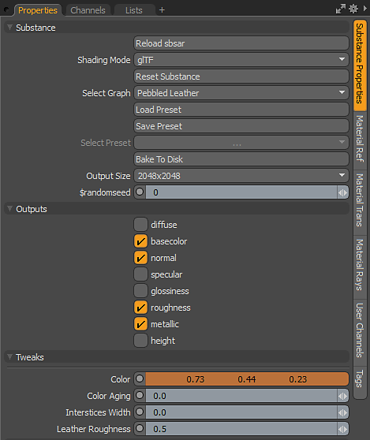
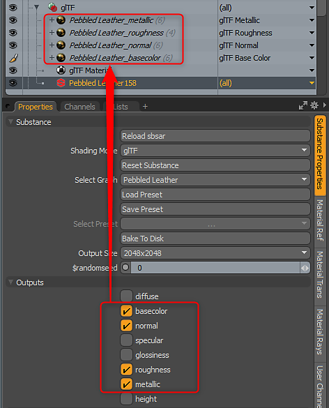
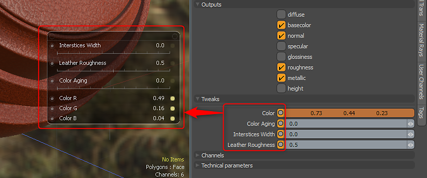

# Parameters

A Substance has a set of core parameters. These parameters are divided into Substance, Outputs and Tweaks. They can be found in the Substance Properties panel.   
Substance from Substance Source will contain Technical Parameters and Channels. The Channel options have no effect in MODO. Outputs are enabled/disabled using the Outputs section.

{width="300px"}

## Substance

A Substance has a set of core parameters, which can be found in the Substance category of the Substance Properties panel.

* **Reload Substance:** This parameter allows you to reload a Substance. It is designed for use withSubstance Designer. If you are working on a custom Substance and have added a new tweak or output, you can reload the newly published Substance back into MODO. The new tweaks and outputs will be added and the previous tweak settings will remain.
* **Shading Mode:** This parameters allows you to set the shading mode to use for the Substance. Principled (default), Unreal, Unity or glTF.
* **Reset Substance:** This parameter will reset the tweaks to the default settings.
* **Select Graph:** Allows you to choose which graph in the Substance file from which to create a material.
* **Load Preset:** You can load a preset, which will configure the Substance tweak parameters. Presets can be created using Substance Player. The preset file is a .sbsprs file type. Once you have loaded a preset, you then need to click the Preset dropdown and choose the preset as a .sbsprs can contain several presets.
* **Save Preset:** Allows you to save a preset
* **Select Preset:** Allows you to choose an embedded preset in the Substance file or from presets saved within MODO.
* **Bake to Disk:** This parameter will bake the textures generated by the Substance to a bitmap file.
* **Output Size:** This parameter will dynamically resize the texture to the size set. The Substance Engine will regenerate the texture to the desired size.
* **Random Seed:** This parameter will vary the procedural generation of the Substance. This parameter is great for creating a randomized version of the same Substance. It allows you to quickly vary the Substance parameters to generate a new version of the textures

## Outputs

The Output options allow you to enable or disable Substance outputs. An output is what is generated by the Substance Engine and rendered as a texture in the Shader Tree.

{width="300px"}

## Tweaks

Tweaks are parameters that are authored in the Substance file and editable in MODO. You can select channels and in Item Mode use Channel Haul to gain the controls together in a popup controller.

{width="300px"}
