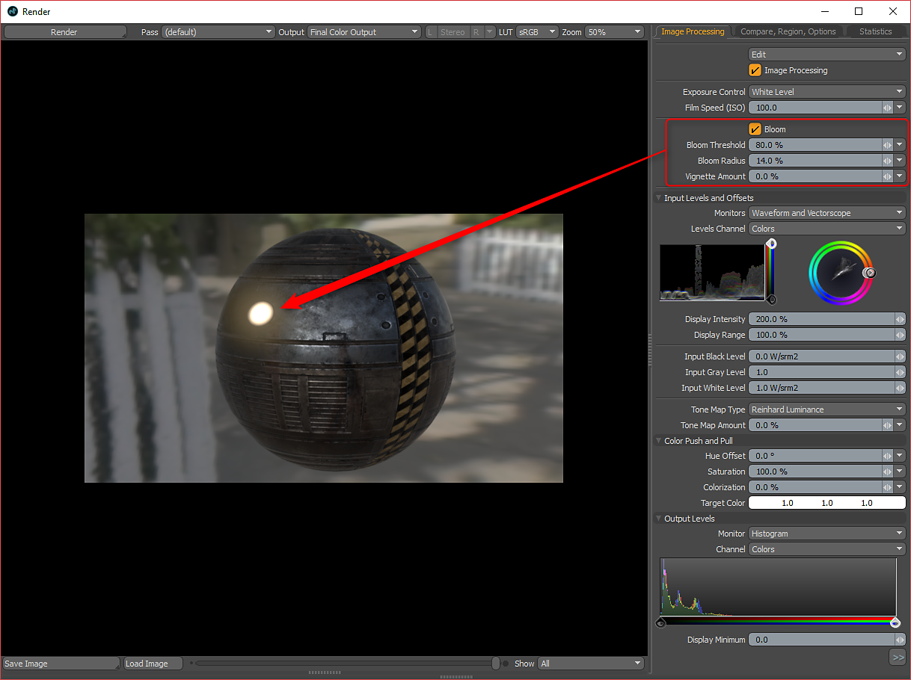

# Working with Emissive

## Working with Emissive (Luminous Amount and Color)

Substance can have an optional emissive output. You can use this as Luminous Amount and Color in MODO. When you enable emissive output, it will be set to the Luminous Amount effect. By default, this channel is interpreted as Linear under the Texture Image Still tab.   
Right-click the texture in the Shader tree and choose duplicate. Then, set the duplicated emissive texture to the Luminous Color effect. You can then make changes to the high and low value for the texture driving the Luminous Amount effect to further intensify the value.

>[!NOTE]
>
> For the texture set to Luminous Color, you need to set the interpretation to sRGB in the Image Still tab.

To get a bloom effect, you need to enable Bloom in the Render panel and set the Threshold and Radius.

For the Unreal and Unity materials, the Emissive output is handled specifically by the material.   
Unreal = Unreal Emissive  
Unity = Unity Emission  
  
The Unreal Emissive and Unity Emission textures need to be changed from Linear to sRGB in the Image Still tab.
