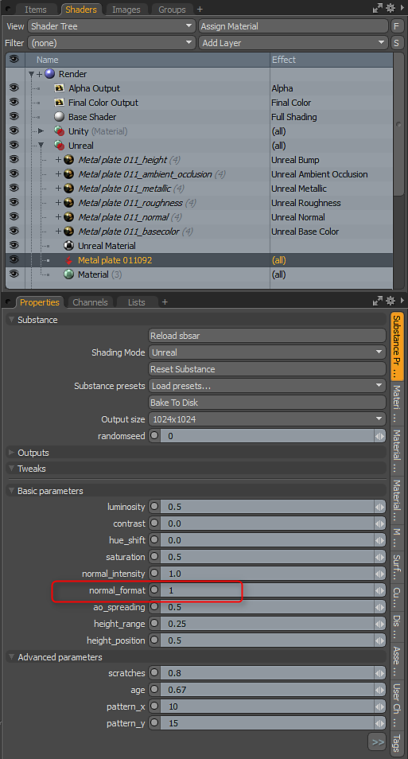
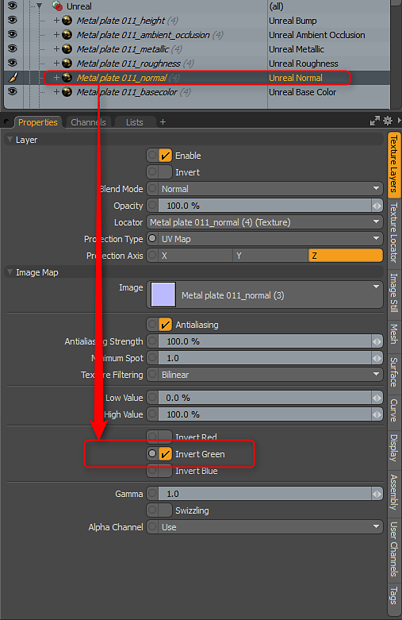

# Working with Normals

Working with Normal Data - Setting the correct orientation

Stock Substances are built to use DX normal orientation. However, MODO uses OGL. You can flip the normal by setting the Normal Format parameter to 1.0. The Substance Plugin will only interpret the parameters set in the Substance. You may encounter a Substance that doesn't have the "normal\_format" parameter as it's up to the author of the Substance to add this control to custom Substances. If you encounter a Substance that doesn't have this parameter, you can flip the green channel on the normal map's Texture Layer to fix the orientation.

>[!NOTE]
>
> Flipping the green channel is only if the Substance has the wrong normal orientation and the author didn't create a control to flip the normal in the Substance parameters

<table>
<tr style="border: 0;">
<td style="border: 0;" valign="top">

</td>
<td style="border: 0;" valign="top">

</td>
</tr>
</table>
