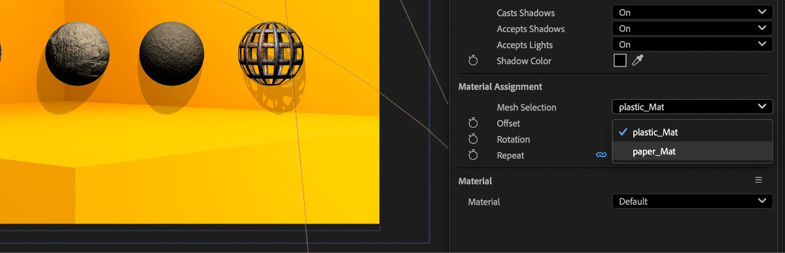

# After Effects

Adobe After Effects supports the use of SBSAR files, so you can apply materials to your 3D objects with all the custom parameters that the SBSAR format supports.

[You can learn more about how to use SBSAR files in After Effects here.](https://helpx.adobe.com/after-effects/using/apply-substance-3d-materials.html)
