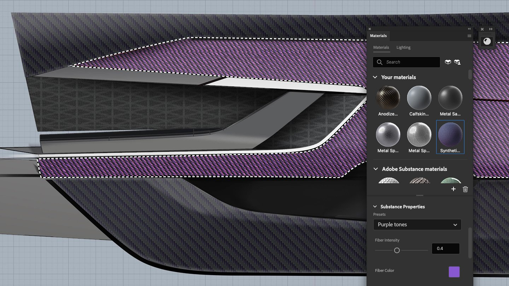

# Photoshop

The Substance 3D Material plugin for Photoshop is a powerful tool, that lets you to import and use .sbsar files as parametric materials in your projects. Substance materials offer more advanced customization options compared to Photoshop’s native patterns, allowing you to apply realistic 3D textures with just one click and fine-tune settings such as patterns, colors, and even lighting.

For more information, please see the [Adobe Substance 3D materials for Photoshop HelpX page](https://helpx.adobe.com/photoshop/using/substance-3d-materials-for-photoshop.html).
