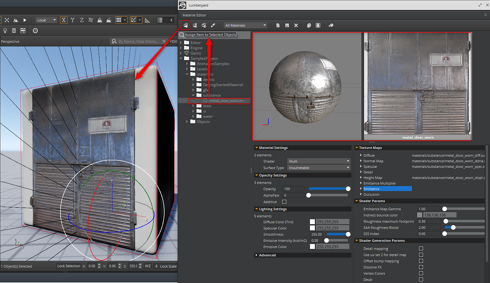

# Assigning a Substance

You use the Material Editor to assign the substance material just as you would any other material in Lumberyard.

1. Click the Material Editor button to open the editor and navigate to the location in the materials folder were you copied the substance file.
1. Select the object and the material and then click the "Assign Item to Selected Objects" button at the top of the Material Editor.

