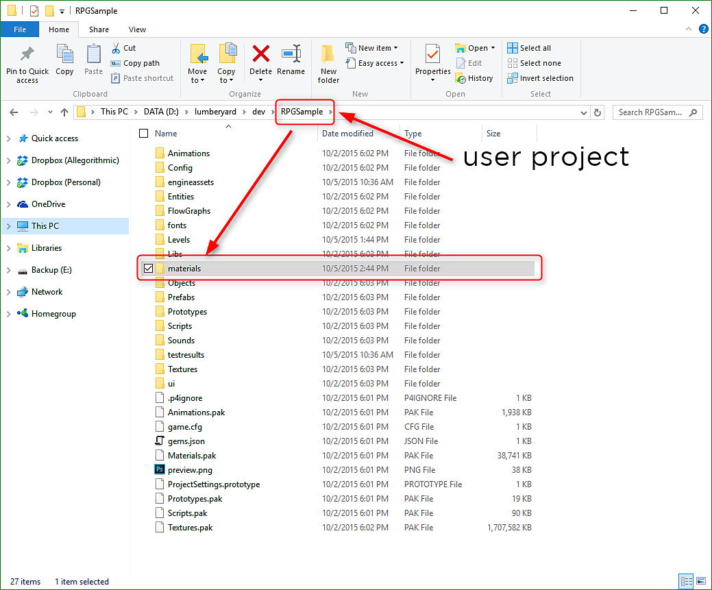

# Importing a Substance

A substance material can be imported into your project. Once the substance material file (.sbsar) has been copied to the project folder, you can use the Procedural Material Editor to import the substance into your project as well as change substance parameters.

1. Copy the substance material (.sbsar) to your project's "materials" folder. You can create sub-directories within the materials folder for organizational purposes.

   
1. Click the Procedural Material Editor button at the top of the Lumberyard UI to open the dialog. In the Procedural Material Editor Dialog, choose File&gt;Import Substance and navigate to the substance file that you copied to your project's materials folder in step 1. Once all substances have been imported, you can close the dialog.

   
