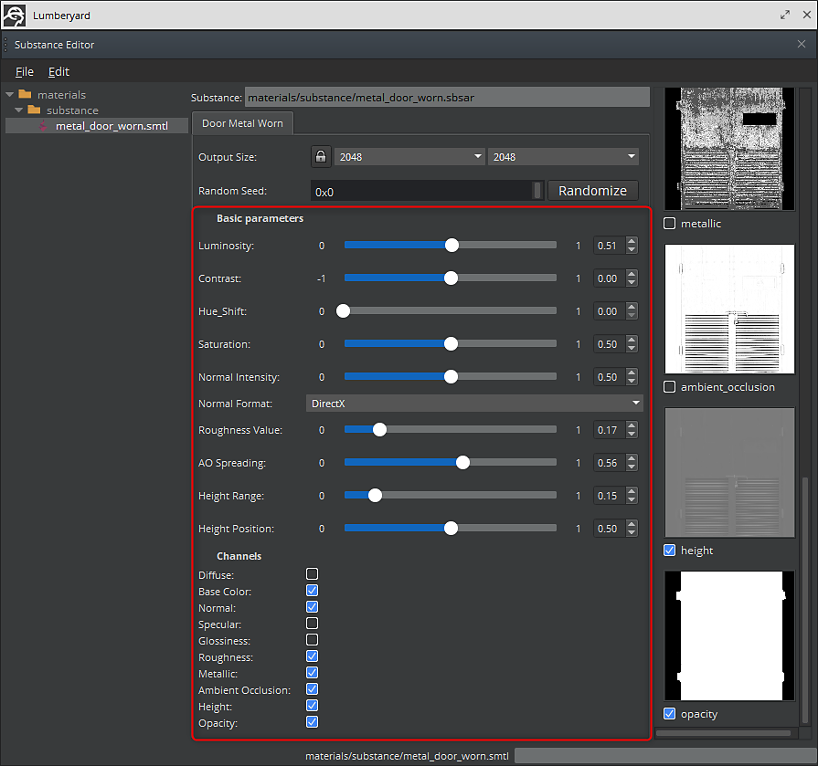
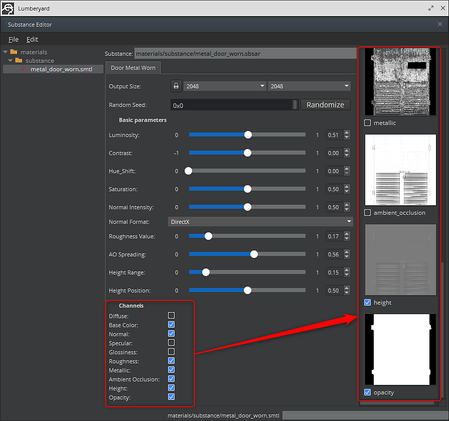

# Parameters and outputs

You use the Procedural Material Editor to change the parameters of a substance. The left column of the dialog lists the substances. The middle column of the dialog lists the parameters for the selected substance and the right column shows the outputs for the selected substance. Outputs can be enabled and disabled by click the check box button.

1. Open the Procedural Material Editor and select the substance. Select the substance on the left column. The parameters will be loaded in the middle column along with the associated outputs for the substance on the far right column.

   
1. You can also enable other Substance outputs that are not enabled by default to create the textures.

   
1. Once you have made the tweaks, be sure to save the material settings using File&gt;Save.
