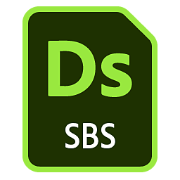
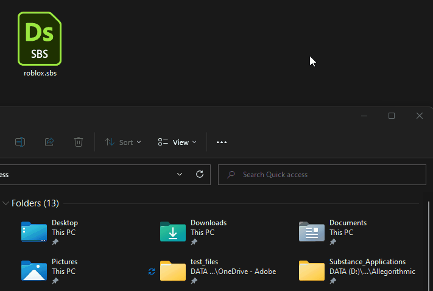
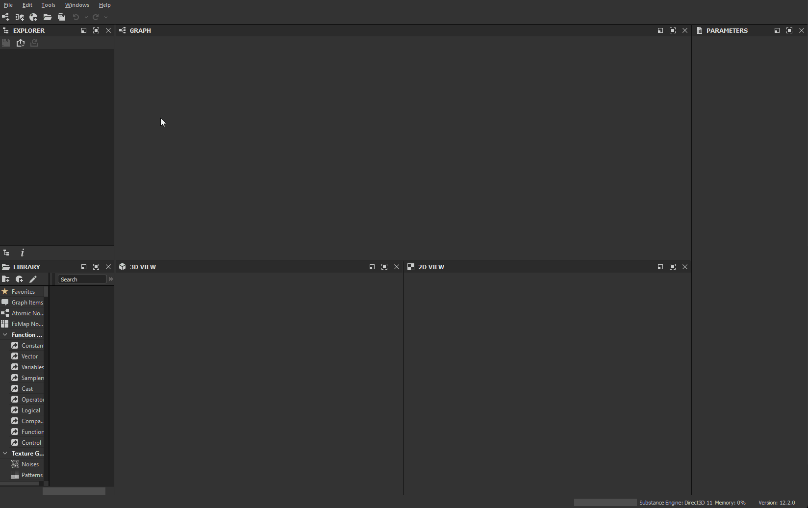
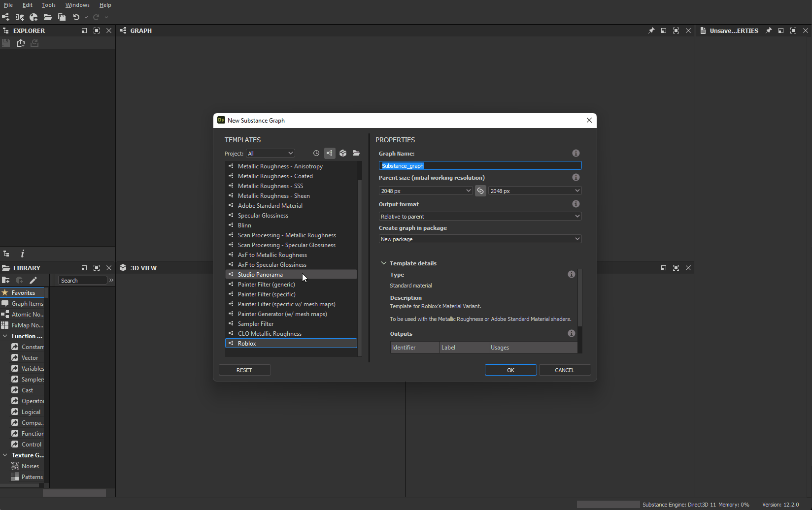

# Roblox

[Roblox](https://www.roblox.com/) is a platform for immersive, 3D multiplayer experiences. Roblox Studio, the Roblox design tool, supports the PBR Metallic Roughness workflow.

<table>
<tr style="border: 0;">
<td width="58.30%" style="border: 0;" valign="top">

## Substance 3D Designer template

To create textures for Roblox, you can use the Substance 3D file below as a [Substance compositing graphs](https://helpx.adobe.com/substance-3d-designer/substance-compositing-graphs.html) template in [Substance 3D Designer](https://helpx.adobe.com/substance-3d-designer/home.html).

[{width="64px"}](https://helpx.adobe.com/content/dam/roblox.sbs)

This graph template allows for the pre-configuration of final texture file names and types. This template can be installed and reused to create new materials that always follow the Roblox material guidelines.

</td>
<td width="41.60%" style="border: 0;" valign="top">

{width="200px"}

</td>
</tr>
</table>

## Designer to Roblox workflow

<table>
<tr style="border: 0;">
<td style="border: 0;" valign="top">

### Install template

First, *install* the Roblox template.

* Download the template file linked above.
* Go to Designer's user documents directory:
* (Creative Cloud Desktop) `/Documents/Adobe/Adobe Substance 3D Designer`  
  (Steam) `/Documents/Allegorithmic/Substance Designer/`
* Create a templates folder.
* Place the file in that folder.

</td>
<td style="border: 0;" valign="top">

{width="512px"}

</td>
</tr>
</table>

<table>
<tr style="border: 0;">
<td style="border: 0;" valign="top">

### Detect template

Then, have Designer *watch* the templates folder to look for graph templates.

* In Designer, go to **Edit &gt; Preferences...**
* In the [Preferences](https://helpx.adobe.com/substance-3d-designer/interface/preferences-window.html) window, go to **Projects &gt; User project &gt; General**
* In the **Templates Directories** list, click the **+** button
* Go to the `templates` directory and click **Select Folder**
* Click the **OK** button
* Go to **File &gt; New &gt; Substance graph...**
* Check that the `Roblox` template is listed at the bottom of the templates list in the [New Substance graph](https://helpx.adobe.com/substance-3d/unlisted/documentation/sddoc/create-a-graph-102400068.html) window

</td>
<td style="border: 0;" valign="top">

{width="512px"}

</td>
</tr>
</table>

<table>
<tr style="border: 0;">
<td style="border: 0;" valign="top">

### Export textures

Create a graph using the Roblox template and export bitmaps out of that graph once you are done working on a material.

* In the [New Substance graph](https://helpx.adobe.com/substance-3d/unlisted/documentation/sddoc/create-a-graph-102400068.html) window, select the `Roblox` template
* Set any identifier and other parameters for the graph and click **OK**
* Work on your material in the [Graph View](https://helpx.adobe.com/substance-3d-designer/interface/the-graph-view.html) – see [here](https://helpx.adobe.com/substance-3d-designer/getting-started/workflow-overview.html) for getting started with the workflow
* Once you are done, go to **Tools &gt; Export bitmaps...** in the Graph View *toolbar*
* In the [Export bitmaps](https://helpx.adobe.com/substance-3d-designer/substance-compositing-graphs/exporting-bitmaps.html) window, set a valid **Destination** path, make sure *all* the outputs are *checked* and click **Export**
* Check the textures are correctly exported to the **Destination** path

</td>
<td style="border: 0;" valign="top">

{width="512px"}

</td>
</tr>
</table>

<table>
<tr style="border: 0;">
<td style="border: 0;" valign="top">

### Create material in Roblox

In Roblox, create a Material Variant and assign the textures exported from Designer.

* Select the **Model** tab and click **Material Manager**
* Select a *material template* and click the **Create Variant** button
* In the **Create variant** window, set a name for the material
* For *each material channel*, click the **Import** button and select the corresponding texture exported from Designer
* Click **Save**

</td>
<td style="border: 0;" valign="top">

{width="512px"}

</td>
</tr>
</table>

<table>
<tr style="border: 0;">
<td style="border: 0;" valign="top">

### Apply material

Use your new material variant in your Roblox scene

* *Select* any part(s) or mesh(es) in your Roblox scene
* In the **Material Manager**, select your *Material variant* and click the **Apply to Selected Parts** button

>[!NOTE]
>
> If the color of the textures look different in Roblox, check the **Color** attribute under the **Appearance** category in the properties of the object the Material Variant is applied to, and make sure it is set to *pure white* – i.e. RGB (255, 255, 255), which is labeled *Institutional white* in Roblox.

</td>
<td style="border: 0;" valign="top">

{width="512px"}

</td>
</tr>
</table>

<table>
<tr style="border: 0;">
<td style="border: 0;" valign="top">

### Adjust tiling

The amount of repetition of the material on a surface – i.e., tiling – may be adjusted at any time.

* In the **Material Manager**, select your *Material variant* and click the **Edit** button
* In the **Edit Variant** window, adjust the value of the **Studs Per Tile** property under **Additional** – a *lower* value results in *more* repetition

</td>
<td style="border: 0;" valign="top">

{width="512px"}

</td>
</tr>
</table>
