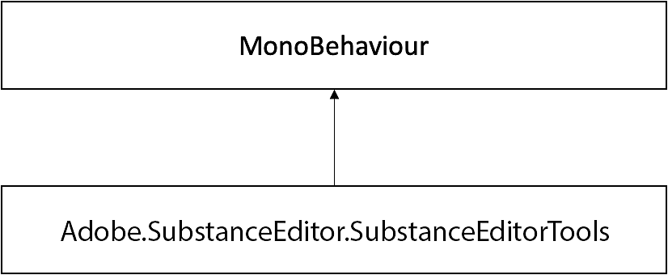

# SubstanceEditorTools

## Adobe.SubstanceEditor.SubstanceEditorTools Class Reference

Tools and utilities for users to utilize on Editor scripts.

Inheritance diagram for Adobe.SubstanceEditor.SubstanceEditorTools:



### Static Public Member Functions

```

• static void SetGraphFloatInput (SubstanceGraphSO graph, int inputId, float value)
```


Set graph float input.

```

• static void SetGraphFloat2Input (SubstanceGraphSO graph, int inputId, Vector2 value)
```


Set graph float2 input.

```

• static void SetGraphFloat3Input (SubstanceGraphSO graph, int inputId, Vector3 value)
```


Set graph float3 input.

```

• static void SetGraphFloat4Input (SubstanceGraphSO graph, int inputId, Vector3 value)
```


Set graph float4 input.

```

• static void SetGraphIntInput (SubstanceGraphSO graph, int inputId, int value)
```


Set graph int input.

```

• static void SetGraphInt2Input (SubstanceGraphSO graph, int inputId, Vector2Int value)
```


Set graph int2 input.

```

• static void SetGraphInt3Input (SubstanceGraphSO graph, int inputId, Vector3Int value)
```


Set graph int3 input.

```

• static void SetGraphInt4Input (SubstanceGraphSO graph, int inputId, int value0, int value1, int value2, int value3)
```


Set graph int4 input.

```

• static void SetGraphInputString (SubstanceGraphSO graph, int inputId, string value)
```


Set graph string input.

```

• static void SetGraphInputTexture (SubstanceGraphSO graph, int inputId, Texture2D value)
```


Set graph texture input.

```

• static void RenderGraph (SubstanceGraphSO graph)
```


Renders target graph and updates its assets.

```

• static string CreatePresetFromCurrentState (SubstanceGraphSO graph)
```


Creates a preset XML from the current state of the graph object.

```

• static List< SubstanceGraphSO > GetGraphs (this SubstanceFileSO fileSO)
```


Returns the list of SubstanceGraphSOs associated with a SubstanceFileSO.
