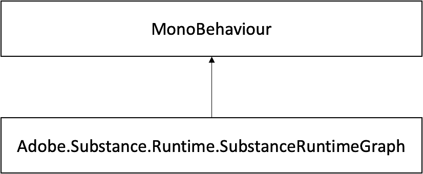

# SubstanceRuntimeGraph Class

## Adobe.Substance.Runtime.SubstanceRuntimeGraph Class Reference

Class that provides runtime functionality to modify inputs at and render substance graphs, allowing Substance←GraphSO to generate its assets at runtime.

Inheritance diagram for Adobe.Substance.Runtime.SubstanceRuntimeGraph:



### Public Member Functions

```

• void AttachGraph (SubstanceGraphSO graph)
```


Attaches a new graph object to this runtime handler.

```

• void SetInputFloat (string inputName, float value)
```


Update Substance Float Input

```

• float GetInputFloat (string inputName)
```


Get Substance Float Input

```

• void SetInputVector2 (string inputName, Vector2 value)
```


Update Substance Vector2 Input

```

• Vector2 GetInputVector2 (string inputName)
```


Get Substance Vector2 Input

```

• void SetInputVector3 (string inputName, Vector3 value)
```


Update Substance Vector3 Input

```

• Vector3 GetInputVector3 (string inputName)
```


Get Substance Vector3 Input.

```

• void SetInputVector4 (string inputName, Vector4 value)
```


Update Substance Vector4 Input

```

• Vector4 GetInputVector4 (string inputName)
```


Get Substance Vector4 Input

```

• void SetInputColor (string inputName, Color value)
```


Update Substance Color Input

```

• Color GetInputColor (string inputName)
```


Get Substance Color

```

• void SetInputBool (string inputName, bool value)
```


Update Substance Boolean Input

```

• bool GetInputBool (string inputName)
```


Get Substance Boolean Input.

```

• void SetInputInt (string inputName, int value)
```


Update Substance Int Input

```

• int GetInputInt (string inputName)
```


Get Substance Int Input

```

• void SetInputVector2Int (string inputName, Vector2Int value)
```


Update Substance Vector2Int Input.

```

• Vector2Int GetInputVector2Int (string inputName)
```


Get array of 2 int.

```

• void SetInputVector3Int (string inputName, Vector3Int value)
```


Update Substance Vector3Int Input.

```

• Vector3Int GetInputVector3Int (string inputName)
```


Get array of 3 int (Vector3Int’s x, y &amp; z values)

```

• void SetInputVector4Int (string inputName, int x, int y, int z, int w)
```


Update Substance Vector4Int Input

```

• int[ ] GetInputVector4Int (string inputName)
```


Get array of 4 int (Vector4Int’s x, y, z &amp; w values)

```

• void SetInputString (string inputName, string value)
```


Update Substance string Input.

```

• string GetInputString (string inputName)
```


Get Substance string input.

```

• SubstanceInputDescription GetInputDescription (string inputName)
```


Returns the complete input description for the target input name.

```

• void SetInputTexture (string inputName, Texture2D value)
```


Update Substance Texture2D Input.

```

• Vector2Int GetTexturesResolution ()
```


Returns instance texture output resoltion.

```

• void SetTexturesResolution (Vector2Int size)
```


Sets instance texture output resolution.

```

• bool HasInput (string inputName)
```


Returns true if this substance instance has an input with a given name.

```

• List< Texture2D > GetGeneratedTextures ()
```


Returns a list with all output textures for the substance instance.

```

•  Texture2D GetOutputTexture (string outputName)
```


Returns the output texture for a given output name.

```

• void Render ()
```


Renders the substance instance synchronously.

```

• Task RenderAsync ()
```


Renders the substance instance asynchronously.

```

• void LoadPreset (string presetXML)
```


Uses a preset XML to set graph input parameters.

```

• string CreatePresetFromCurrentState ()
```


Saves the current graph state into a preset XML.

## Public Attributes

```

• SubstanceGraphSO GraphSO
```


Target substance instance.

## Protected Member Functions

```

• void Awake ()
```


On awake SubstanceRuntime will be used to create a instance for the attached SubstanceGraphSO in the substance

SDK.

```

• void Update ()
```


Check the render ConcurrentQueue for render results.

```

• void OnDestroy ()
```


Disposes the substance SDK handler.

## Properties

```

• Material DefaulMaterial [get]
```


Main material generated by the substance instance.
