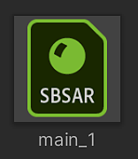
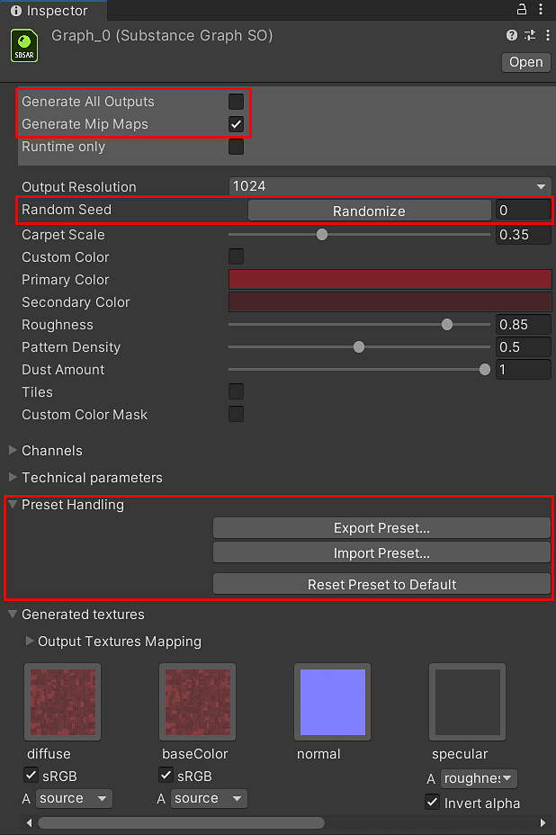

# Changing parameters

<table>
<tr style="border: 0;">
<td style="border: 0;" valign="top">

Parameters for the Substance material are accessible on the Substance Graph Object (SGO).

1. In the Project window, Select the sbsar file logo for the graph you want to customize. The sbsar has the green "SBSAR" logo.

   

## Procedural Properties

1. **Generate All Outputs**: Generates all outputs from the Substance sbsar file. By default only outputs used by the Standard shaders are created.
1. **Generate Mipmaps**: Will generate mip textures for each Substance output.
1. **Random Seed**: This button will change the random seed the Substance graph uses to generate the textures. Changing this value will create a new result for the computed texture based on the seed value.
1. The parameters exposed in the Substance file are available in Unity. The Editor control is based on the type of parameter that was created for the Substance.
1. **Preset Handling:** You can export or import Substance preset files (sbsars). Exporting a preset will create a preset file based on the parameter settings for the Substance. You can export preset files from Substance Designer and Substance Player which can then be imported using the Import Preset button. This is helpful for sharing Substance presets across applications and teams.

</td>
<td style="border: 0;" valign="top">

</td>
</tr>
</table>
