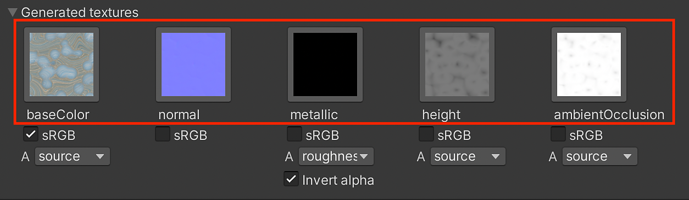
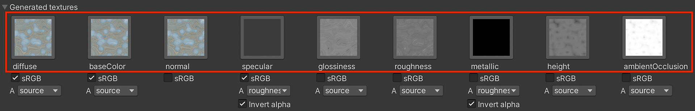
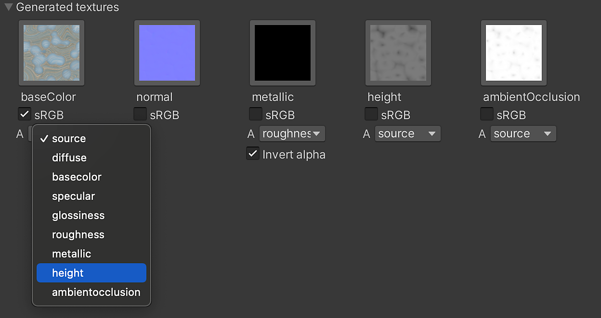
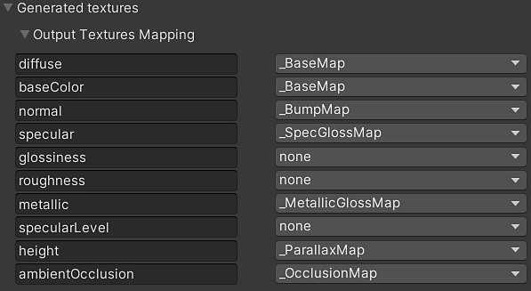

# Generated Textures (Packing)

The Generated Textures show the outputs from the Substance that are computed by the Substance Engine to create textures. These textures are fed into the shader inputs. By default, the only the base inputs used by the shader are created. If "Generate All Outputs" is enabled, all of the textures will be shown here.

When "Generate All Outputs" is enabled

## Usage

1. Selecting a texture Icon will select the texture in the Project Window. This does not work for runtime materials because textures are not generated in the project folder.
1. The sRGB button works similarly to the sRGB (color texture) option in the Texture Import Settings. It allows you to set if a texture is to be interpreted in gamma space (sRGB) or linear. The Substance plugin handles this interpretation automatically but it can be overridden if needed.

   | Substance Output | sRGB |
   | --- | --- |
   | Base color | Enabled |
   | Diffuse | Enabled |
   | Specular | Enabled |
   | Normal | Disabled |
   | Metallic | Disabled |
   | Roughness | Disabled |
   | Glossiness | Disabled |
   | Height | Disabled |
   | Ambient Occlusion | Disabled |

## Packing Channels

You can pack a texture into the alpha channel of another texture using the drop-down menu. Each generated texture has a drop-down menu that contains a list of all of the texture outputs generated by the Substance materials. Simply choose a map from the list to pack it into the alpha channel of the texture. The Source option is the alpha channel of the texture.

In this image, I have selected the height map:

In the following image, you can see that the height output is being packed into the alpha channel of the base color map.

## Output Texture Mapping

Additionally, output texture can be individually assigned to the Surface Inputs of Unity materials via the Output Texture Mapping section. The output textures generated by the .sbsar will be displayed on the left column, and available Unity Surface Inputs appear on the right column. The later can be changed via the dropdowns.

