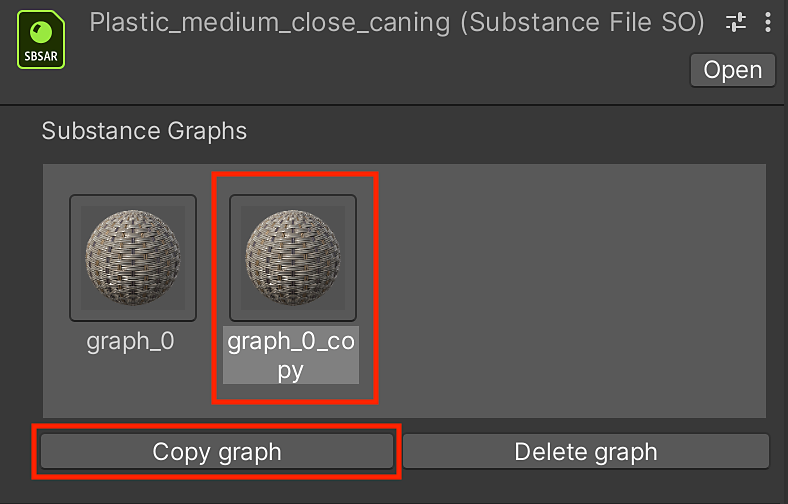

# Managing Substance Graphs

## Managing Substance Graphs

You can create new materials based on the Substance material using the Substance Graph Manager (SGM).

1. Click on the sbsar root object in the Project window.

   
1. In the Inspector, you can create a new material by clicking "Copy graph" button in the manager window as shown in step 1.

   
1. A new material and Substance Graph Object (SGO) are created in the Project.
1. You can click the "Delete graph" button to properly remove the material.

   
