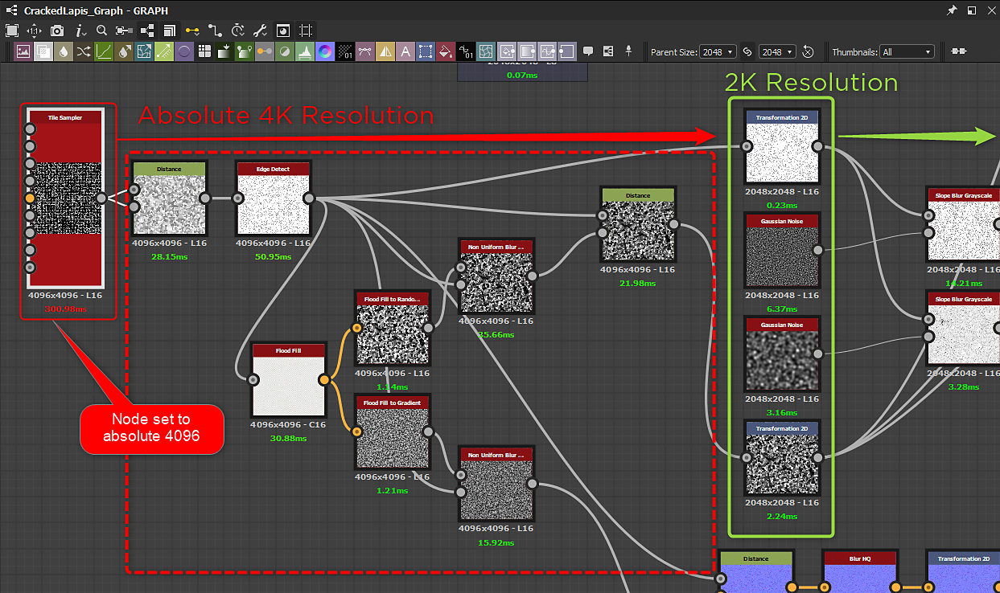

# Optimization Guidelines

The more complex your Substance materials are, the more processing power is needed to render them. Substance materials must therefore **strike a balance between complexity and rendering speed**. This is *especially* important if they will be used in real-time graphics applications, such as games.

When creating your own custom Substance materials, be sure to check the following optimization guidelines.

[Substance Designer Optimization Guidelines](https://docs.substance3d.com/display/SDDOC/Performance+Optimization+Guidelines)

A major caveat to look out for are nodes that have an absolute resolution of 4K or higher.

>[!WARNING]
>
> **Pay careful attention to the resolution and relative-to-parent resolution settings!**   
> High values will seriously affect performance, so consider how the material is likely to be used and whether you can reduce the data sizes involved.  
>   
> The Substance CPU engine can compute at 4K, but it is very slow and can cause an integration to hang or possibly crash.

In the following example, a [Tile Sampler](https://helpx.adobe.com/substance-3d-designer/substance-compositing-graphs/nodes-reference-for-substance-compositing-graphs/node-library/texture-generators/patterns/tile-sampler.html) node's output size is set to [Absolute](https://helpx.adobe.com/substance-3d-designer/substance-compositing-graphs/output-size.html) 4096. It causes several nodes downstream to compute at 4K before being down-scaled for the final 2048 output resolution.

{width="1000px"}
