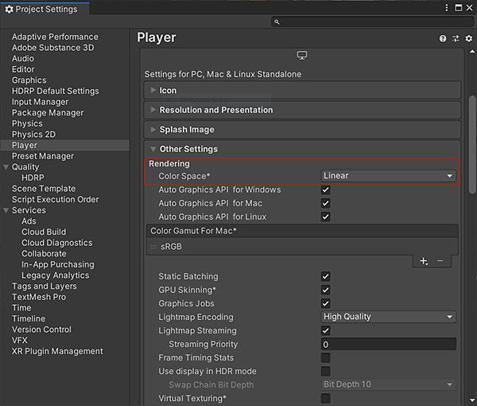

# Rendering Color Space

Substance textures are designed to be used with a Physically-based shader. For the best results, you should set the color space to linear in the Unity Player Settings.

1. Go to Edit&gt;Project Settings&gt;Player
1. In the Rendering section, change the Color Space to Linear. (Unity defaults to Gamma space, which is incorrect and will result in your texture color looking wrong).

   >[!NOTE]
   >
   > **Info**
   > 
   > sRGB options on textures are disabled if the Color Space Setting in Unity is set to Gamma

   {width="600px"}
