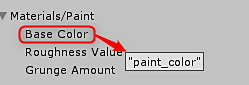
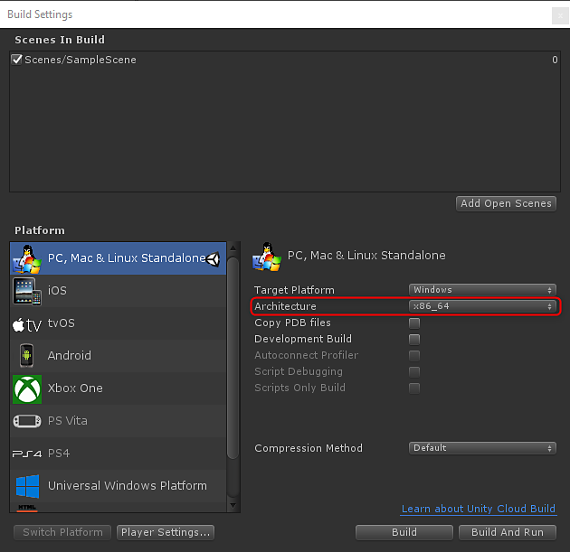

# API Overview

## Substance.Game

```

Using Substance.Game
```


Substance.Game is the assembly that contains the classes used for scripting. These classes are as follows:

**Substance.Game.****Substance**: References the sbsar

**Substance.Game.SubstanceGraph**: Individual graph in the sbsar.*(used to be ProceduralMaterial in Unity 2017)*

## Scripting Process

1. Create an instance of SubstanceGraph
1. Set parameters on the graph instance.
1. Queue the Substance for Rendering: QueueForRender() will add the substance graph to a queue. This list will be processed by the next call to RenderAsync or RenderSync.

### Graph instance parameters

```

// panel color 

mySubstance.SetInputColor("paint_color", color); 

 

// panel size 

mySubstance.SetInputVector2("square_open", panelSize); 

 

// wear level 

mySubstance.SetInputFloat("wear_level", wearLevel);
```


The value in quotes is the parameter Identifier set in Substance Designer.

In the Unity Inspector, you can mouse over a parameter to reveal a tooltip that showcases the name of the Identifier set in Substance Designer.



### Queue the substance for rendering

```

// queue the substance to render 

mySubstance.QueueForRender(); 

 

//render all substances async 

Substance.Game.Substance.RenderAsync();
```


>[!NOTE]
>
> Currently, we only support x86\_64 Architecture. You need to set x86\_64 in the Build Settings


