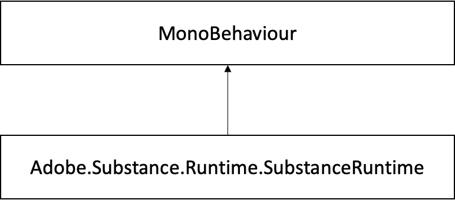

# SubstanceRuntime Class

## Adobe.Substance.Runtime.SubstanceRuntime Class Reference

Singleton class that handles Substance engine initialization and it is used to get native handlers to substance instances.  
 Inheritance diagram for Adobe.Substance.Runtime.SubstanceRuntime:



### Public Member Functions

```

• SubstanceNativeGraph InitializeInstance (SubstanceGraphSO substanceInstance)
```


Creates a Substance SDK handle for a given SubstanceGraphSO.

### Properties

```

• static SubstanceRuntime Instance [get]
```


Singleton instance.

### Detailed Description

Singleton class that handles Substance engine initialization and it is used to get native handlers to substance instances.

### Member Function Documentation

#### InitializeInstance()

```

SubstanceNativeGraph Adobe.Substance.Runtime.SubstanceRuntime.InitializeInstance  

( SubstanceGraphSO substanceInstance ) [inline]
```


Creates a Substance SDK handle for a given SubstanceGraphSO.

**Parameters**

|  |  |
| --- | --- |
| substanceInstance | Target SubstanceGraphSO |


**Returns**

Handle that communicates with the Substance SDK

### Property Documentation

#### Instance

```

SubstanceRuntime Adobe.Substance.Runtime.SubstanceRuntime.Instance [static], [get]
```


Singleton instance.

Global singleton instance.

>[!NOTE]
>
> The NativeGraph.InRenderWork is intended only for internal use only to communicate with the Substance Engine, and should not be used for custom workflows.
