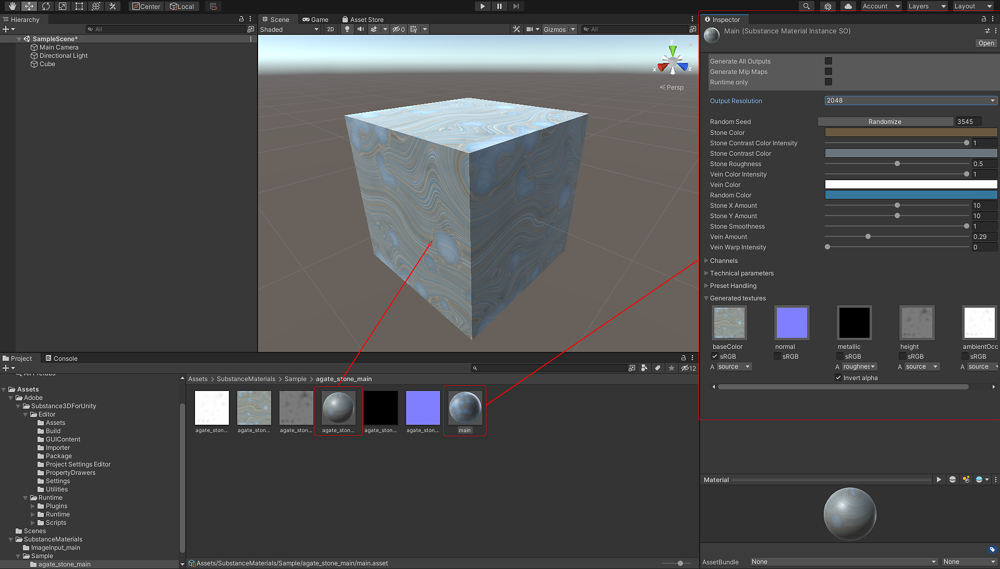

# Unity Plugin Overview

## Unity Version Support

The Adobe Substance 3D for Unity Plugin version 3.0.0 currently supports Unity 2020 LTS and higher.

## Downloading the Substance Package

1. The Plugin can be downloaded from the Unity Asset Store: <https://assetstore.unity.com/packages/tools/utilities/substance-3d-for-unity-beta-213208>

## Importing a Substance Material

1. Right-click in the Project window and choose Import Asset, or drag the Substance Material you wish to import into the project view panel.
1. Browse for the Substance Material you would like to import. Substance Materials have the ".sbsar" file extension.
1. The Substance material will be imported into your Unity project.

   1. The sbsar asset will create a main import file and a folder containing the output textures and a generated Unity material.
1. You can then drag and drop the material on a mesh in the Scene view and then edit the parameters in the Inspector.

   {width="1000px"}

>[!NOTE]
>
> **Normal Map Conversion**
> 
> The Substance in Unity plugin will automatically converts DirectX to OpenGL. When using materials from [Substance Source](https://source.substance3d.com/), you do not need to change the normal orientation to OGL. If you are creating your own material in Substance Designer, be sure you work with the default DirectX shader as the plugin will handle the normal conversion automatically. For more info, please check .

## Changing Parameters

Parameters and resolutions can be set in the Inspector window. Please see [Changing Parameters](../changing-parameters/changing-parameters.md).

[unity\_tweaking\_parameters.mp4](https://helpx.adobe.com/content/dam/help/en/substance-3d/documentation/download/attachments/186056716/unity-tweaking-parameters.mp4)

## Unity Render Pipeline Support

The Substance 3D plugin supports HDRP and URP. More information will be available soon.

## How to tutorial
