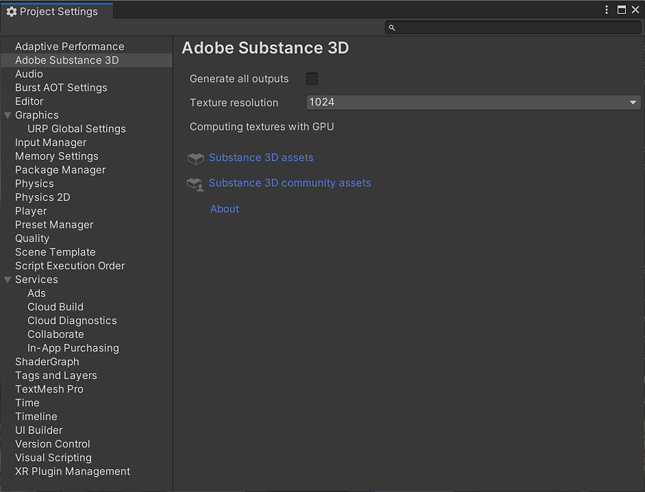

# Unity Preferences

The Adobe Substance 3D preference window allows you to set user-defined options for the plugin.

**Generate all graph outputs** - Will always generate all graph outputs per graph.

**Texture resolution** - Default resolution for generated textures per graph

**CPU max resolution** - The maximum texture resolution supported when using CPU engine.

**Substance 3D assets** - Link to the Substance 3D Assets page.

**Substance 3d community assets** - Link to the Substance 3D Community Assets page.

**About** - Displays plugin version information.

