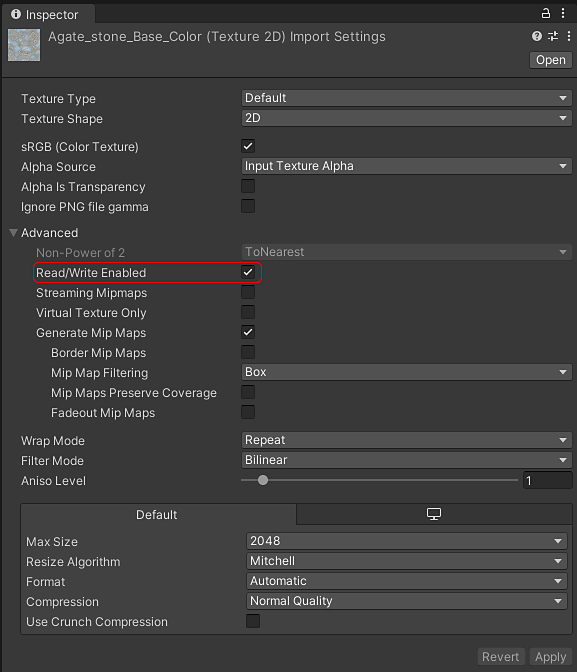

# Using Image Inputs

In order to use an image in an input parameter for a Substance:

1. In the inspector window for the Substance Graph you can select textures in your project to assign to image inputs.

   
1. Note that selecting a texture will cause it the textures "Read/Write Enabled" field to be checked, as this is required for reading the texture data into the Substance material

   
