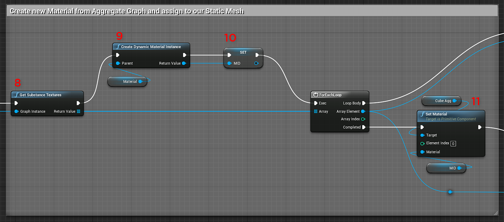
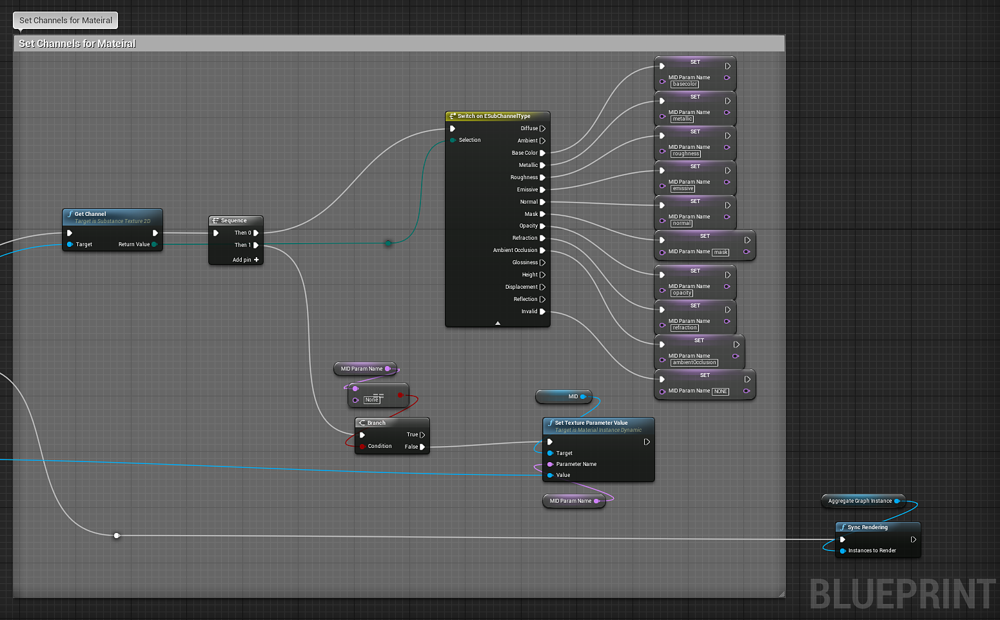

# Blueprint(UE4): Aggregate Substance

The new aggregate substance node allows you to take two substance instance factories and create a new instance factory at runtime which can be used to create a new graph instance. What makes this special is that you can connect output textures from one of the combined graph instances to input images of the other combined graph instance. To create a substance graph instance from this new factory, see our documentation on runtime graph instances. [Material Instance Definition - UE4](https://helpx.adobe.com/substance-3d/unlisted/documentation/integrations/material-instance-definition-157352129.html)

1. Import Substances you want to use.
1. Create a variable "AggregateGraphInstance" of type **Substance Graph Instance**.
1. Create a variable of type **Material** and **Material Instance Dynamic**
1. Create a **Make Substance Connection** and set the output and input identifiers.
1. Create **Aggregate Substance Instance Factory** and set the Output and Input Factory.
1. Create a **Graph Instance** and set an Instance Name.
1. Set the **Aggregate Graph Instance** variable.
1. Get substance textures from the Aggregate Graph Instance in step 7 using **Get Substance Textures**.
1. Create a **Dynamic Material Instance** using the material variable from step 3 as the parent.
1. Set the MID variable from step 3.
1. Set the material for the mesh using **Set Material** with the MID variable.

    {width="800px"}
1. Set the channels for the material as shown in the Dynamic Material Instance docs (steps 11-19)   
    [Blueprint(UE4): Dynamic Material Instance](https://helpx.adobe.com/substance-3d/unlisted/documentation/integrations/blueprint-dynamic-material-instance-152535142.html)

    {width="800px"}
