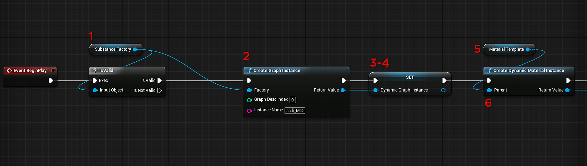
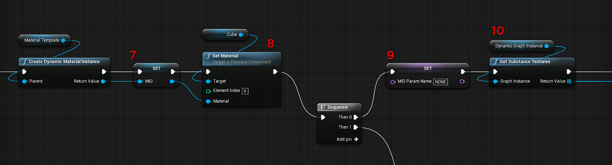
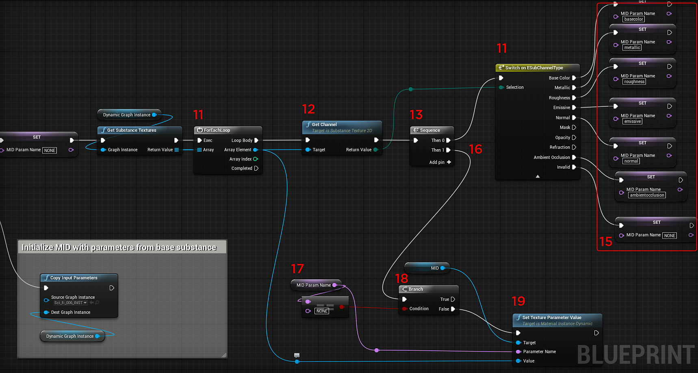
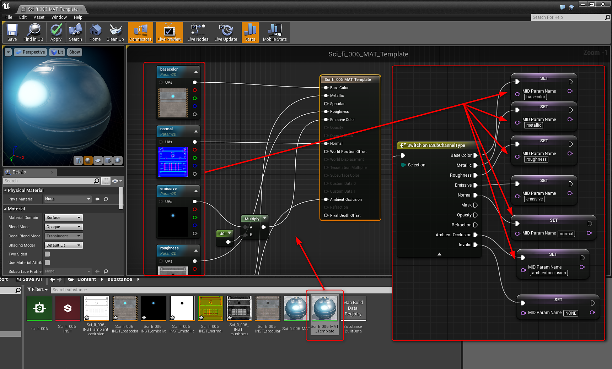

# Blueprint(UE4): Dynamic Material Instance

You can create a Substance Graph Instance to create a Dynamic Graph Instance at runtime.

1. Create a variable of type Substance Instance Factory and set the default value to the Imported Substance Factory.
1. Add a Create Graph Instance node and plug the Substance Instance Factory into the Factory input. Set an Instance name.
1. Create another variable of type Substance Instance Factory. This will hold a references to the dynamic substance material.
1. Set the variable for the dynamic substance material with the return value of the Create Graph Instance node.
1. Create a variable of type Material. This will be the material template. In the Content Browser, make a duplicate of the UE4 material generated by the Substance. Set this duplicated material as the input for the material template variable.
1. Add a Create Dynamic Material Instance and set the Material Template variable as the parent.

   {width="800px"}
1. Create a variable of type Material. This will be the Material Instance Dynamic (MID). Set the return value of the Dynamic Material Instance to the variable.

   {width="800px"}
1. Add a Set Material Node and set the value of the MID variable as the Material Input. For the target, set it to the object you want to apply the material.
1. Create a variable of type Name. This variable will hold the name for the channels set in the material. Initialize this with a value of "NONE"
1. Add a Get Substance Textures node and set the Graph Instance to the Dynamic Graph Instance variable.
1. Add a For Loop node. Here you loop through the Substance Textures. Take the result of the Get Substance Textures as the input array.

    {width="800px"}
1. Add a Substance Get Channel node with the array element from the for loop as input.
1. Add a Sequence node. Here we will first run the result of the Get Channel node.
1. Add a Switch on ESubChannelType after the Sequence Then 0 with the Get Channel return value as the Selection. Here we check the channels names.
1. Set the MID Name variable to the channel names in the duplicated Substance Material from step 5. *See the material image.*
1. In the Sequence node Then 1, you will set up the process of assigning the channel names to the dynamic material.
1. Get the MID name variable and add an equal string node with a value of "NONE" This is the value will initialized the variable.
1. Add a Branch Node with the Condition from the Equal node.
1. Add a Substance Set Texture Parameter Value. The target is the MID variable and the parameter name is the MID name variable. The Value is the Array Element from the ForEachLoop Node.

{width="800px"}
