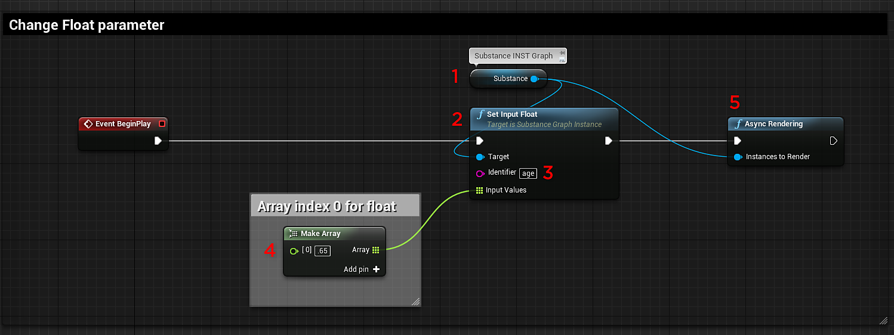
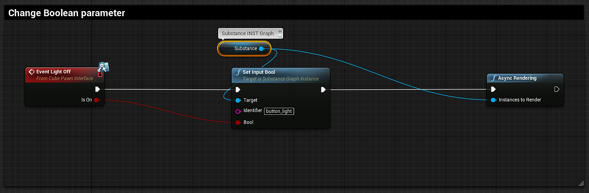
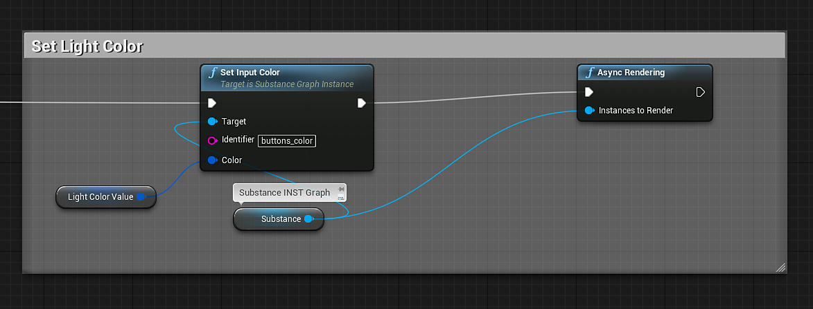
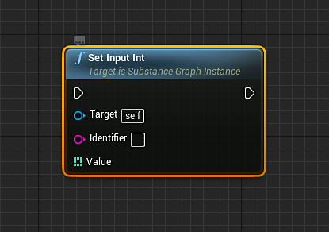
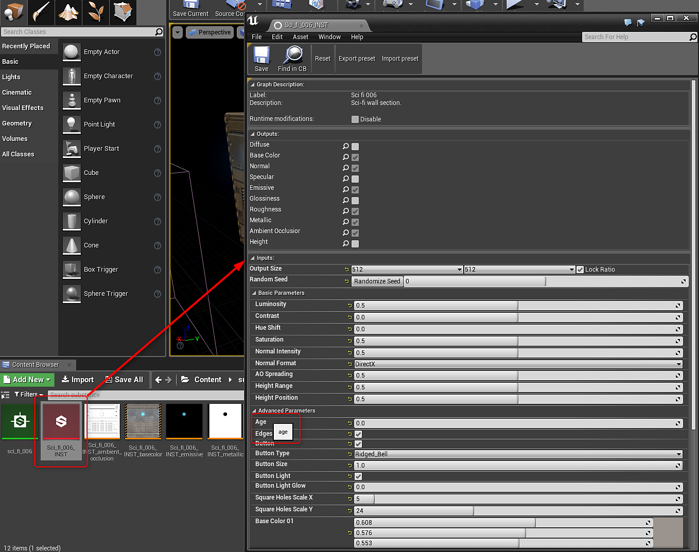

# Blueprint(UE4): Substance material parameters

## Changing a float parameter:

You will use the [Set Input Float node](https://helpx.adobe.com/substance-3d/unlisted/documentation/integrations/blueprint-node-reference-151584784.html) to change a float, color(float4) and Boolean substance parameters.

1. Create a variable with a type of "Substance Graph Instance" as a Reference.
1. Create a Set Input Float Node and set the target as the Substance Graph Instance variable.
1. On the Set Input Float node, set the Identifier to be the name of the Substance Parameter to change.   
   *\* You can find the Identifier name by opening the Substance INST and mouse over the parameter name. The Identifier name will appear in the tooltip popup.*
1. On the Input Float Node, drag out a connection and create a Make Array Node. The Make Array Node will have an index of 0. The index of 0 corresponds to the float value.
1. Create an Async or Sync rendering node and connect the execution line from the Set Input Float to the Render Node. Set the Instances to Render to the Substance Graph Instance Variable.   
   *\* Async is non-blocking and Sync is blocking.*

{width="800px"}

## Boolean parameters

Boolean parameters are changed using Set Input Bool.

{width="800px"}

## Color parameters

Color parameters are changed using the Set Input Color.

{width="800px"}

## Changing a Integer parameter:

Integer parameters work the same as the Set Input Float. You will use the Set Input Integer Node.

## Identifiers

You can find the identifier for a parameter in the substance INST. Move your mouse over the parameter and the tooltip will reveal the identifier name. This is the name set in the identifier field of the output in Substance Designer.

{width="800px"}
