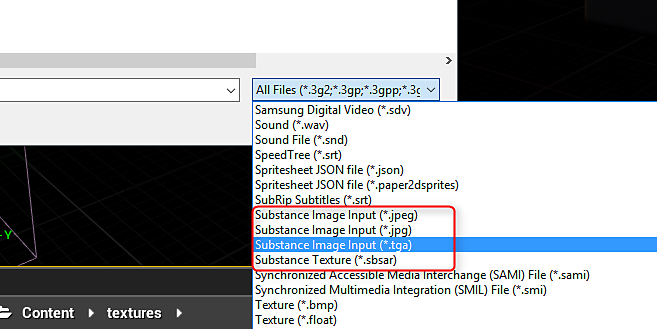
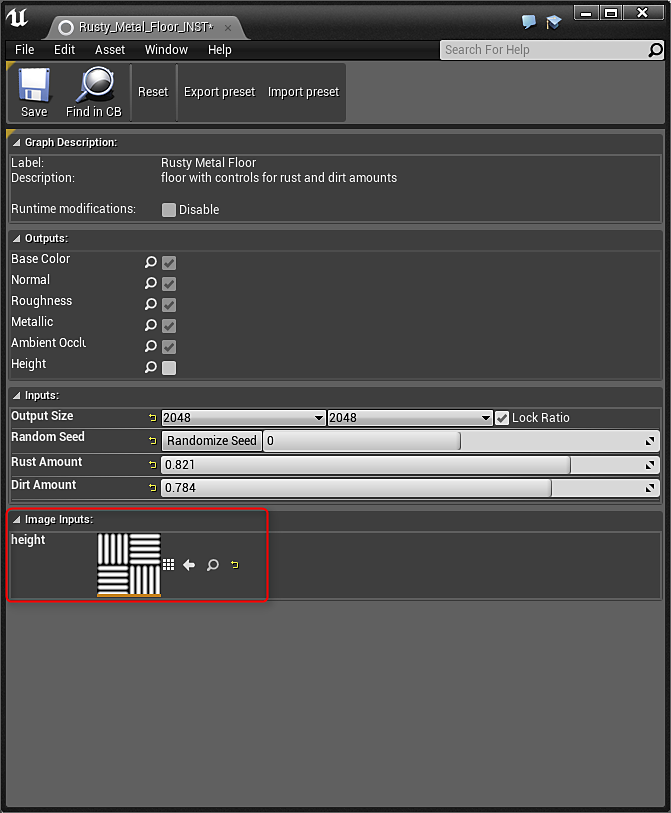

# Substance Input Image - UE4

Substance can be created with inputs where you can supply an image for processing in the material. This allows you to create modular materials that can take baked mesh data or patterns as input to change or conform the material to the asset. In order to use a texture as a substance input, it must be imported into UE4 as a Substance Input Texture.

1. Import the texture into the Content Browser. For the format, choose Substance Image Input (jpg, tga, jpeg).
1. This texture can now be used with a Substance input.

{width="600px"}{width="600px"}
