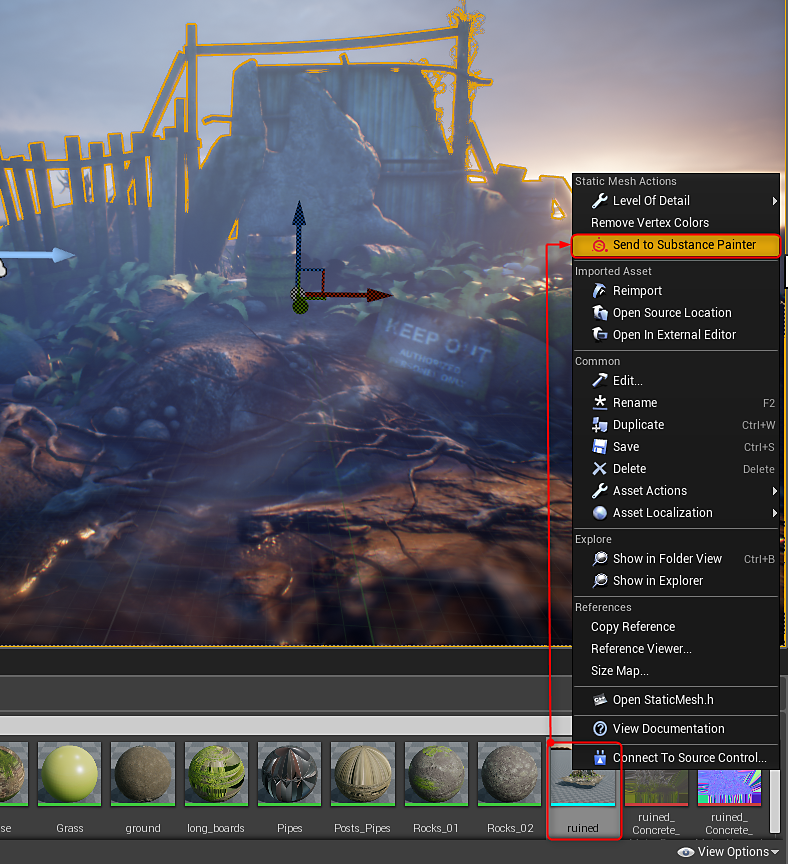
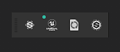
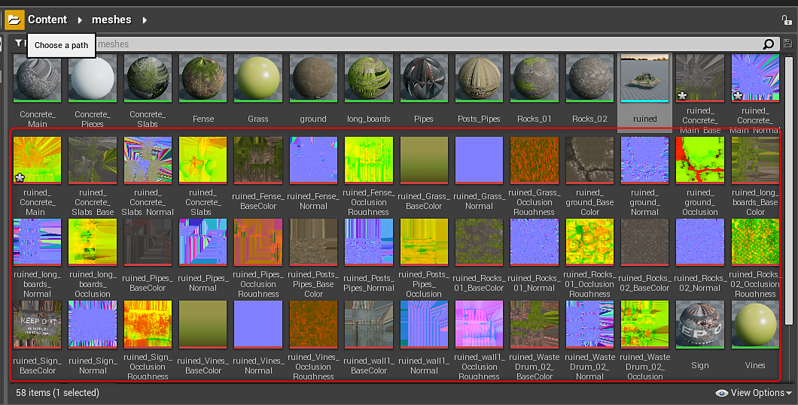
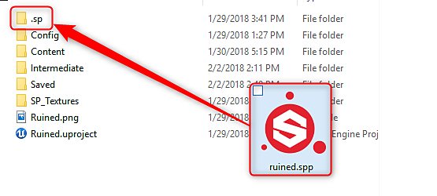
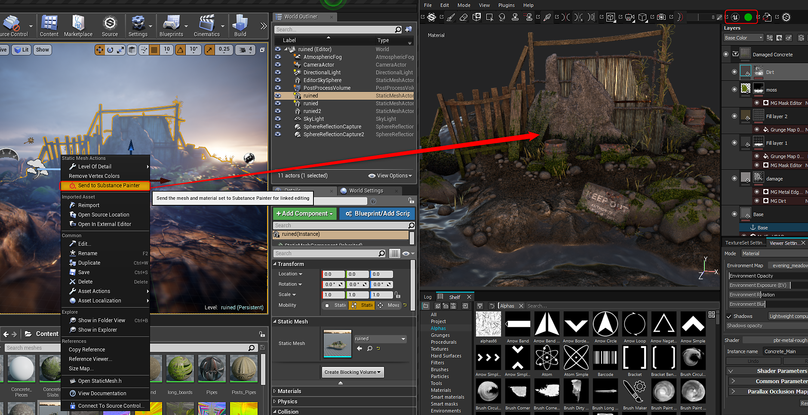

# Live Link in UE4

>[!WARNING]
>
> Live Link in Unreal Engine is no longer supported. Users with an older version of the plugin where Live Link is used will still be able to use the feature.

>[!WARNING]
>
> Live Link doesn't work with UE4 BSP meshes. The asset you send needs to be a model file imported into your UE4 project

## Establishing link to Substance Painter

1. Open Substance Painter
1. Right-click the asset you want to send to Painter in the Content Browser and choose "Send to Painter."

   {width="400px"}
1. The mesh will appear in Substance Painter and you can begin texturing. As you work, textures will be sent to UE4 and applied to the materials. The green dot on the UE4 icon in the toolbar indicates that the link is live and sending textures.

   

   1. You can pause the streaming of data in the Configure options for the plugin. Go to Plugins&gt;dcc-live-link and choose Configure. Disable the Enable Streaming to pause data from being sent to UE4.

      
1. Textures from Painter will appear in the Content Browser and will be applied to the material in UE4.

   {width="500px"}
1. A Substance Painter project (.spp) will be created in the UE4 project folder in a folder labeled ".sp"

   

## Reestablishing a link to Substance Painter

You can pick up where you left off after closing Painter or Unity.

1. Open the .spp project in Substance Painter located in your Unity project&gt;assets&gt;.sp folder.
1. Right-click the mesh in the Content Browser and choose "Send to Painter" to reestablish the link.

   {width="600px"}
