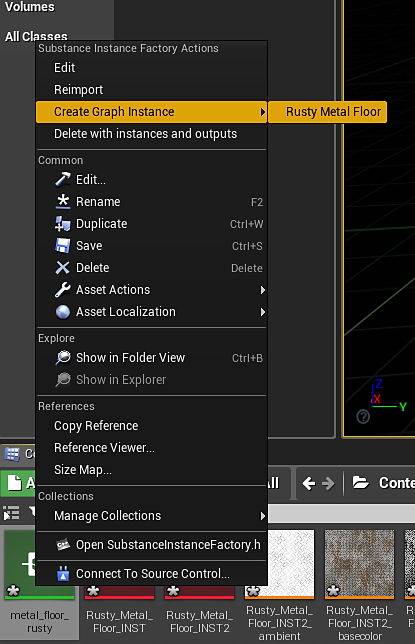

# Material Instance Definition - UE4

You can use UE4 Material Instances with Substances. This will save a large step in the GPU rendering process by not uploading a new material to process. An MID can be created at runtime or in the editor. With version 4.24.0.3, we added full support for material instancing and introduces a new material template workflow with numeric outputs supported by the Substance Engine. Material templates allow you to define exactly how you want to configure your Substance material shaders in UE4.

When you import a sbsar file, you can choose which template you want to work with.

We ship with templates for working with displacement, refraction and world aligned materials that have built in controls for adjusting tiling, texture size, displacement and emissive parameters. The material template system also allows you to supply your own custom templates.

## Creating a Material Instance in the editor

1. Right-click on the substance created UE4 material and choose "Create Material Instance." This creates a UE4 Instanced material.

   {width="560px"}
1. Right-click the substance instance factory and choose "Create a graph instance." This will create an instance of the graph and create another UE4 material. Delete the newly created UE4 material as this will not be used.

   {width="300px"}
1. Double click the material instance you created in step 1 and enable the Texture parameters for all of the maps.
1. Set the texture to the new INST texture that was created from step 2. This will set the material instance to use the substance output maps from the instanced graph.

   {width="800px"}

You now have a UE4 material instance that is using specific set of substance textures. This is a more optimized way of working with multiple substances in a UE4 project. To learn how to create an MID using blueprint, please check this page. [Blueprint(UE4): Dynamic Material Instance](https://helpx.adobe.com/substance-3d/unlisted/documentation/integrations/blueprint-dynamic-material-instance-152535142.html)
