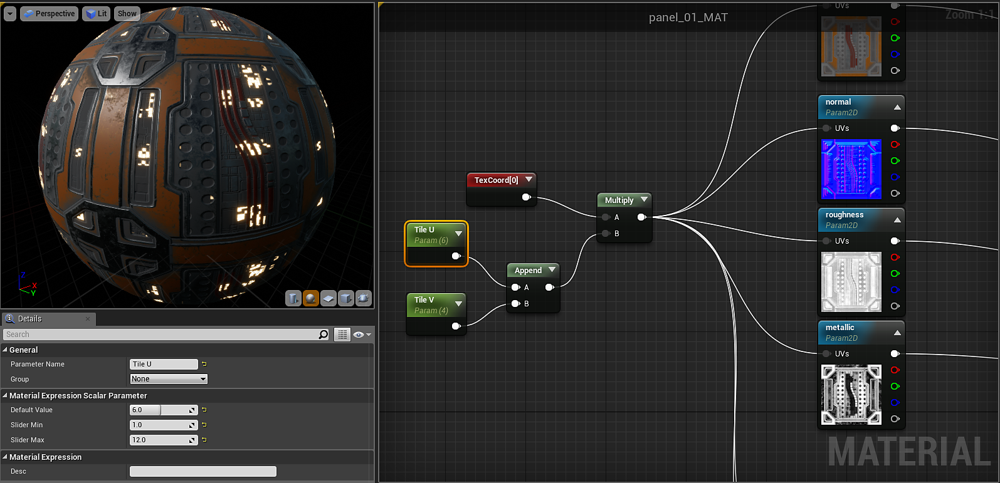

# Tiling Substance - UE4

To tile a substance texture you will need to add a Texture Coordinate node and multiply this by scalar parameter.

<https://docs.unrealengine.com/latest/INT/Engine/Rendering/Materials/ExpressionReference/Coordinates/#texturecoordinate>

To create parameters for both the U and V tile, you can use an Append Vector and multiply this by the TexCoord. This allows you to independently set the U and V tile amounts.

{width="800px"}

 