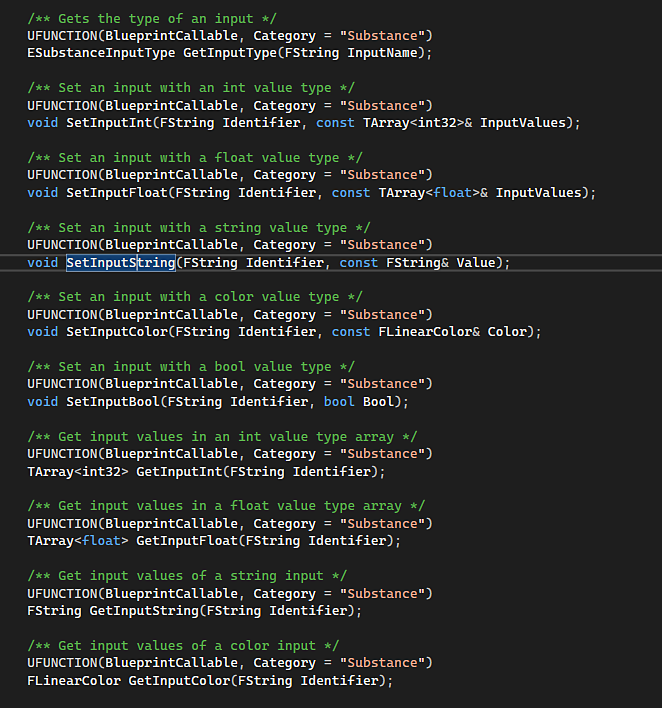

# Unreal Engine 4 Scripting

The Substance in Unreal Engine plugin can be scripted. Methods are listed and annotated in the plugin's SubstanceGraphInstance.h file, which is normally found in the following directory when installing the plugin from the marketplace:

* **Engine Install**: &#91;UE\_4.X.X location&#93;\Engine\Plugins\Marketplace\Substance\Source\SubstanceCore\Classes\SubstanceGraphInstance.h
* **Project Install**: &#91;project folder loacation&#93;\Plugins\Runtime\Substance\Source\SubstanceCore\Classes\SubstanceGraphInstance.h

  

`BlueprintCallable` indicates that the method is usable in the Blueprint editor as well.

## Scripting in Unreal Engine's Python Editor

When using the methods listed in the SubstanceGraphInstance.h file in Unreal Engine's Python editor, they must be converted from Pascal Case to Snake Case (with lowercase lettering an underscore in between each word). For example, `SetInputColor` becomes `set_input_color`.

The Python Editor in Unreal Engine can be accessed via Window &gt; Developer Tools&gt; Output Log, and setting the lower left dropdown to Python.

## Example Scripts

Below are a set of example scripts that can be used in the Python Editor.

## Create a Substance Material

```

## Python example on creating a Substance material.

 

import unreal 

 

## Create factory

sf = unreal.SubstanceFactory() 

factory = sf.import_archive("/Game", "C:/4d/unreal/stylized_lava_cracked.sbsar") 

graph_descs = factory.get_graph_descs() 

mats = unreal.SubstanceUtility.get_substance_included_materials() 

 

## Create graph instance

for graph_desc in graph_descs: 

    print(graph_desc) 

## You could name based on label or on index or another way

    graph_name = "/Game/FirstInstance_" + graph_desc.label 

    material_name = "/Game/FirstMaterial_" + graph_desc.label 

## graph_name = f"/Game/FirstInstance_{graph_desc.index}"

## material_name = f"/Game/FirstMaterial_{graph_desc.index}"

    graph = factory.create_graph_instance(graph_desc, graph_name) 

    graph.create_outputs() 

    graph.create_material(material_name, mats[0]) 

    graph.set_input_color("obsidian_color", unreal.LinearColor(0, 0, 1)) 

    graph.set_input_color("lava_color", unreal.LinearColor(0, 1, 0)) 

    graph.prepare_outputs_for_save() 

    graph.render_sync() 

    graph.save_all_outputs(True)
```


## Create a single graph of a Substance Material

```

## Python example on creating a Substance material.

 

import unreal 

 

## Create factory

sf = unreal.SubstanceFactory() 

factory = sf.import_archive("/Game", "C:/4d/unreal/stylized_lava_cracked.sbsar") 

graph_descs = factory.get_graph_descs() 

mats = unreal.SubstanceUtility.get_substance_included_materials() 

 

## Create only 1 graph instance

graph_desc = graph_descs[0] 

print(graph_desc) 

graph_name = "/Game/MyGraphInstance" 

material_name = "/Game/MyMaterial" 

graph = factory.create_graph_instance(graph_desc, graph_name) 

graph.create_outputs() 

graph.create_material(material_name, mats[0]) 

graph.set_input_color("obsidian_color", unreal.LinearColor(0, 1, 1)) 

graph.set_input_color("lava_color", unreal.LinearColor(1, 0, 0)) 

graph.prepare_outputs_for_save() 

graph.render_sync() 

graph.save_all_outputs(True)
```


## Create multiple instances of a Substance Material with different parameters.

```

## Python example on creating mulitple Substance materials.

 

import unreal 

 

## Create factory. Should only need 1 factory, even if multiple instances are created

sf = unreal.SubstanceFactory() 

factory = sf.import_archive("/Game", "C:/4d/unreal/stylized_lava_cracked.sbsar") 

graph_descs = factory.get_graph_descs() 

mats = unreal.SubstanceUtility.get_substance_included_materials() 

 

## Create first graph instance

for graph_desc in graph_descs: 

    graph_name = "/Game/FirstInstance_" + graph_desc.label 

    material_name = "/Game/FirstMaterial_" + graph_desc.label 

    graph = factory.create_graph_instance(graph_desc, graph_name) 

    graph.create_outputs() 

    graph.create_material(material_name, mats[0]) 

    graph.set_input_color("obsidian_color", unreal.LinearColor(0, 0, 1)) 

    graph.set_input_color("lava_color", unreal.LinearColor(0, 1, 0)) 

    graph.prepare_outputs_for_save() 

    graph.render_sync() 

    graph.save_all_outputs(True) 

 

## Create second graph instance

for graph_desc in graph_descs: 

    graph_name = "/Game/SecondInstance_" + graph_desc.label 

    material_name = "/Game/SecondMaterial_" + graph_desc.label 

    graph = factory.create_graph_instance(graph_desc, graph_name) 

    graph.create_outputs() 

    graph.create_material(material_name, mats[0]) 

    graph.set_input_color("obsidian_color", unreal.LinearColor(1, 0, 1)) 

    graph.set_input_color("lava_color", unreal.LinearColor(1, 1, 0)) 

    graph.prepare_outputs_for_save() 

    graph.render_sync() 

    graph.save_all_outputs(True)
```


## Duplicate a Substance Graph

```

## Python example on duplicating a Subtance material.

 

import unreal 

 

## Create factory

sf = unreal.SubstanceFactory() 

factory = sf.import_archive("/Game", "C:/4d/unreal/stylized_lava_cracked.sbsar") 

graph_descs = factory.get_graph_descs() 

mats = unreal.SubstanceUtility.get_substance_included_materials() 

 

## Create first graph

for graph_desc in graph_descs: 

    print(graph_desc) 

    graph_name = "/Game/FirstGraph_" + graph_desc.label 

    material_name = "/Game/FirstMaterial_" + graph_desc.label 

    graph = factory.create_graph_instance(graph_desc, graph_name) 

    graph.create_outputs() 

    graph.create_material(material_name, mats[0]) 

    graph.set_input_color("obsidian_color", unreal.LinearColor(0, 0, 1)) 

    graph.set_input_color("lava_color", unreal.LinearColor(0, 1, 0)) 

    graph.prepare_outputs_for_save() 

    graph.render_sync() 

 

## Duplicate graph

new_material_name = "/Game/SecondMaterial" 

new_graph = graph.duplicate() 

new_graph.create_outputs() 

new_graph.create_material(new_material_name, mats[0]) 

new_graph.prepare_outputs_for_save() 

new_graph.render_sync()
```
