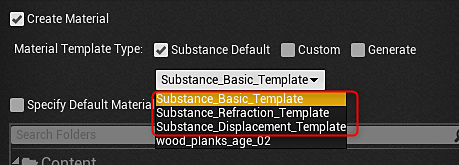
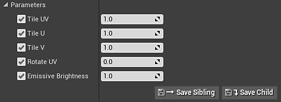

# Unreal plugin 4.24.0.3

Substance in Unreal Engine has undergone a major restructuring. Part of this restructure brings full support of **UTexture2D** and includes both inputs and outputs. With **UTexture2D** support, the plugin can now be used to publish to any platform Unreal supports including mobile. Along with the addition of multiple platform support, **UTexture2D** also allows the native use of the texture streaming system within UE4.

The plugin also brings full support for material **instancing** and introduces a new material template workflow with numeric outputs supported by the Substance Engine. Material templates allow you to define exactly how you want to configure your Substance material shaders in UE4.

We ship with templates for working with displacement, refraction and world aligned materials that have built in controls for adjusting tiling, texture size, displacement and emissive parameters. The material template system also allows you to supply your own custom templates.

