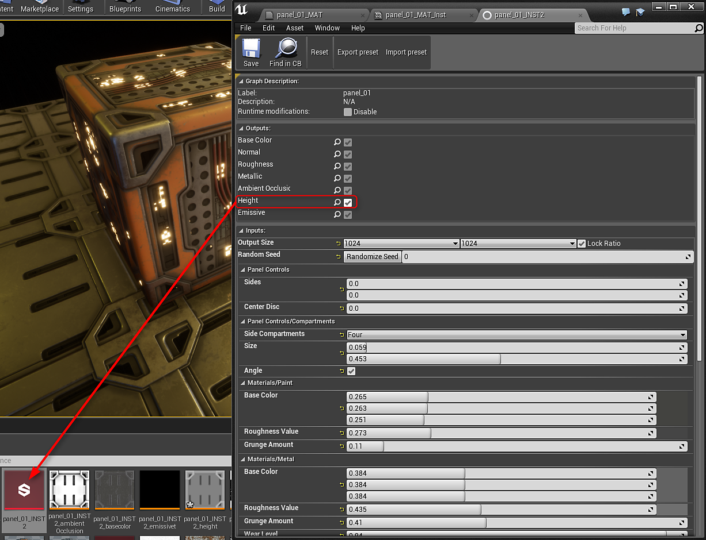
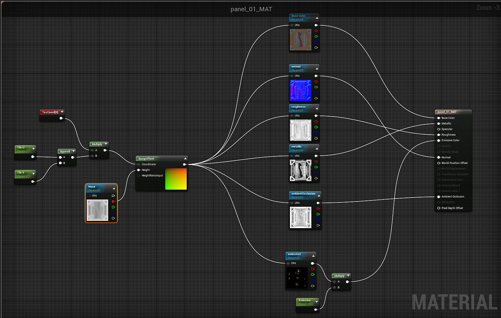

# Working with Bump Offset (Parallax) - UE4

**Bump Offset** mapping give a surface the illusion of depth by modifying the UV coordinates in a creative way to help further displace the texels from the surface of the object, giving the illusion that the surface has more details than it really does. In this How To example, we will be covering not only how you can find the Bump Offset Material Expression, we will also be covering how you can utilize the Bump Offset node in your Materials.

<https://docs.unrealengine.com/latest/INT/Engine/Rendering/Materials/HowTo/BumpOffset/>

To use the height output, you need to double click the Output in the Substance Factory Instance to create height. Height is not enabled by default. You can then drag this height output into your material.

{width="600px"}

Create a bump offset node and then plug in the Red channel of the height into the Height. You can then feed in a TexCoord into the Coordinate input of the bump offset. Finally, the output of the bump offset is plugged into the UV input for all of the Substance textures.

{width="800px"}
