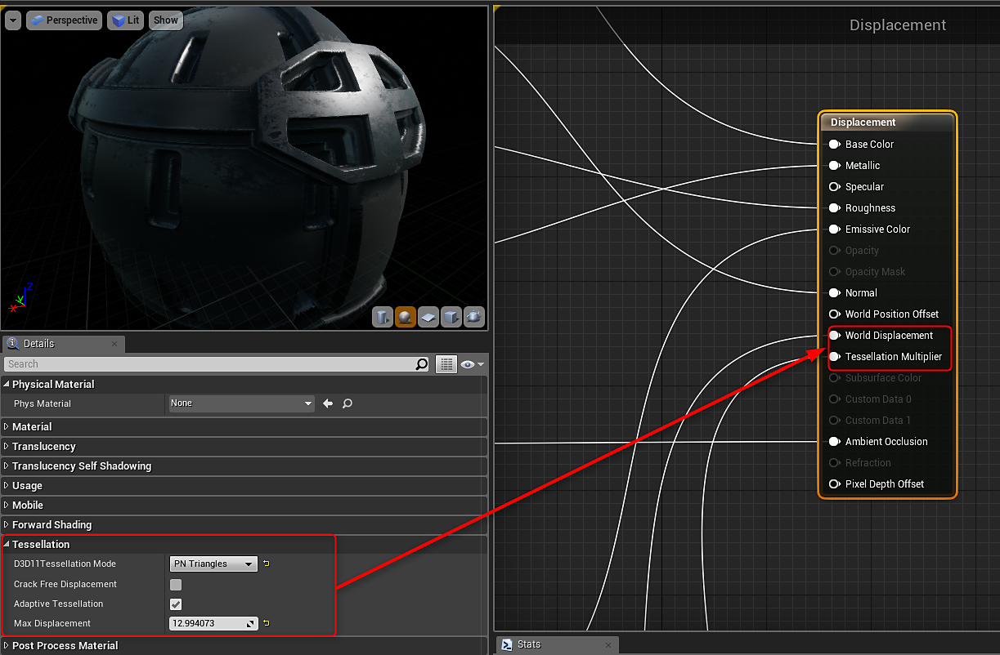
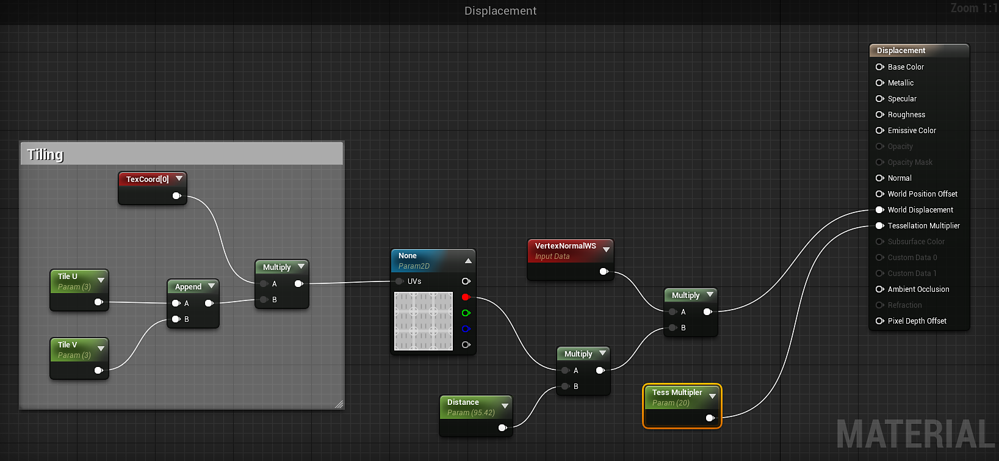

# Working with Displacement - UE4

To work with displacement, you will need to enable tessellation on your material.

{width="600px"}

To use the height output, you need to double click the Output in the Substance Factory Instance to create height. Height is not enabled by default. You can then drag this height output into your material.

{width="800px"}

Once you have added the height output to your material you will need to create a few nodes to drive the World Displacement and Tessellation Modifier.

1. Create 2 scalar parameters. One will be Distance and the other will be the multiplier for tessellation.
1. Multiply the Red channel from the Height to the Distance parameter
1. Add a VertexNormalWS node and multiple this with the output of the multiply in step 2.
1. Input the multiply of the VertexNormal to the World Displacement on the Material.
1. Take the tessellation multiplier parameter and input this to the Tessellation Multiplier on the material.

{width="800px"}

>[!NOTE]
>
> The other texture outputs have been omitted in this image to simplify the graph. Here only the Displacement and Multiplier nodes are shown for clarity.
