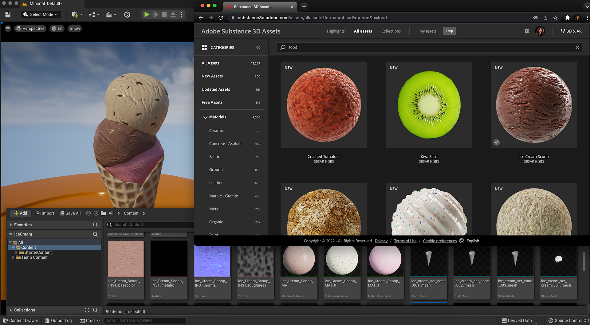

# Substance 3D Assets Library Usage - UE5

Access over 1000 high-quality tweakable and export-ready 4K materials with presets on the [Substance 3D assets library](https://helpx.adobe.com/substance-3d/unlisted/assets.html). You can explore community-contributed assets in the [community assets library](https://helpx.adobe.com/substance-3d/unlisted/community-assets.html).

You can download materials from the asset library and use them in UE5.

