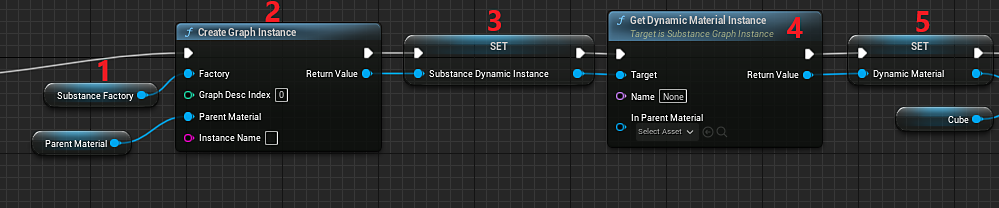

# Blueprint(UE5): Dynamic Material Instance Skip to end of metadata

1. Create a variable of type Substance Instance Factory and set the default value to the Imported Substance Factory.
1. Add a Create Graph Instance node and plug the Substance Instance Factory into the Factory input along with a parent material to act as a template (this can be one of the default\_substance materials included with the plugin).
1. Create another variable to store the Substance Graph Instance object created in the previous step.
1. Use the “Get Dynamic Material Instance” function from the graph instance to create or get an existing material instance. Leaving Name and In Parent Material empty will use the parameters used when generating the instance in step 2.
1. Create a variable of type Material. This will be the Material Instance Dynamic (MID). Set the return value of “Get Dynamic Material Instance” to the variable.

   
1. Add a Set Material Node and set the value of the MID variable as the Material Input. For the target, set it to the object you want to apply the material.
1. Optional: Set any desired substance parameters (this example is using a pre-existing substance graph instance and copying the values to the new one).
1. Create an Async or Sync rendering node and connect the Instances to Render to the Substance Graph Instance Variable.
