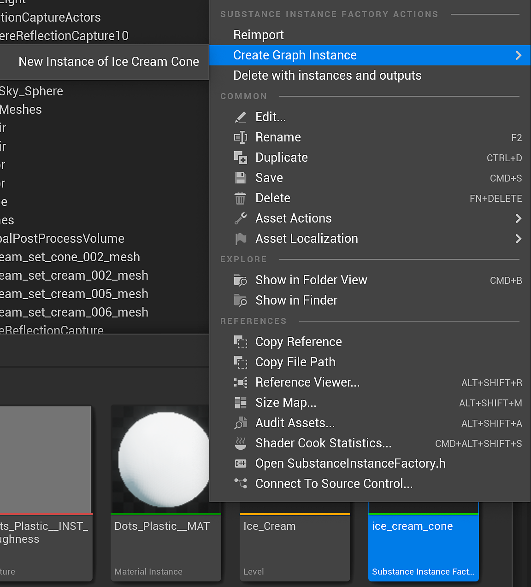
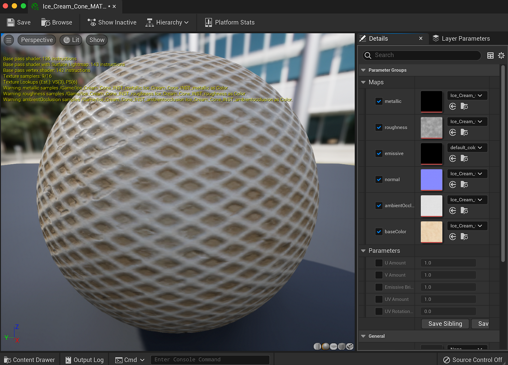

# Material Instance Definition - UE5

You can use UE5 Material Instances with Substances. This will save a large step in the GPU rendering process by not uploading new material to the process. A MID can be created at runtime or in the editor. With version 5.0.0, we added full support for material instancing.

## Creating a Material Instance in the editor

1. Right-click on the substance created UE5 material and choose "Create Material Instance." This creates a UE5 Instance material.

   
1. Right-click the substance instance factory and choose "Create a graph instance." This will create an instance of the graph and create another UE5 material. Delete the newly created UE5 material as this will not be used.

   
1. Double click the material instance you created in step 1 and enable the Texture parameters for all of the maps.
1. Set the texture to the new INST texture that was created from step 2. This will set the material instance to use the substance output maps from the instanced graph.

   

You now have a UE5 material instance that is using a specific set of substance textures. This is a more optimized way of working with multiple substances in a UE5 project. To learn how to create a MID using blueprint, please check this page. [Blueprint(UE5): Dynamic Material Instance](https://helpx.adobe.com/substance-3d/unlisted/documentation/integrations/blueprint-dynamic-material-instance-152535142.html)
