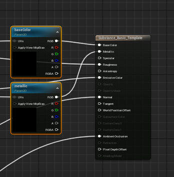

# Material Template Usage - UE5

Material Templates allow the user to create a base material for substances to use as a template for connecting their output nodes to inputs in the material.   
 Outputs sharing the same name and type as a material input will automatically be used. This Parent Material example has a “baseColor” texture sample node that will get filled in if the Substance has a texture output also named “baseColor”.   
  

Substance outputs support updating textures, single float, or int scalar values, and vector (2-4) values. To use float or int outputs at runtime you must get the dynamicMaterialInstance from the graph as constantMaterialInstances (any materials generated in editor) cannot change scalar values at runtime.

The substance graph instance will attempt to fill in all relevant output values at the time of creation.

