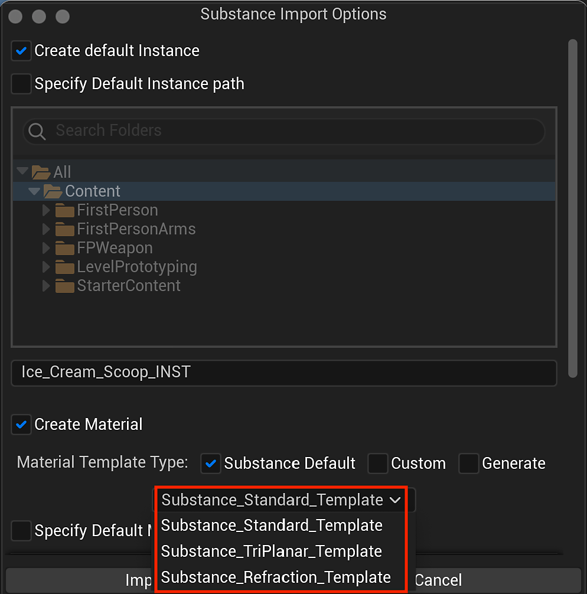
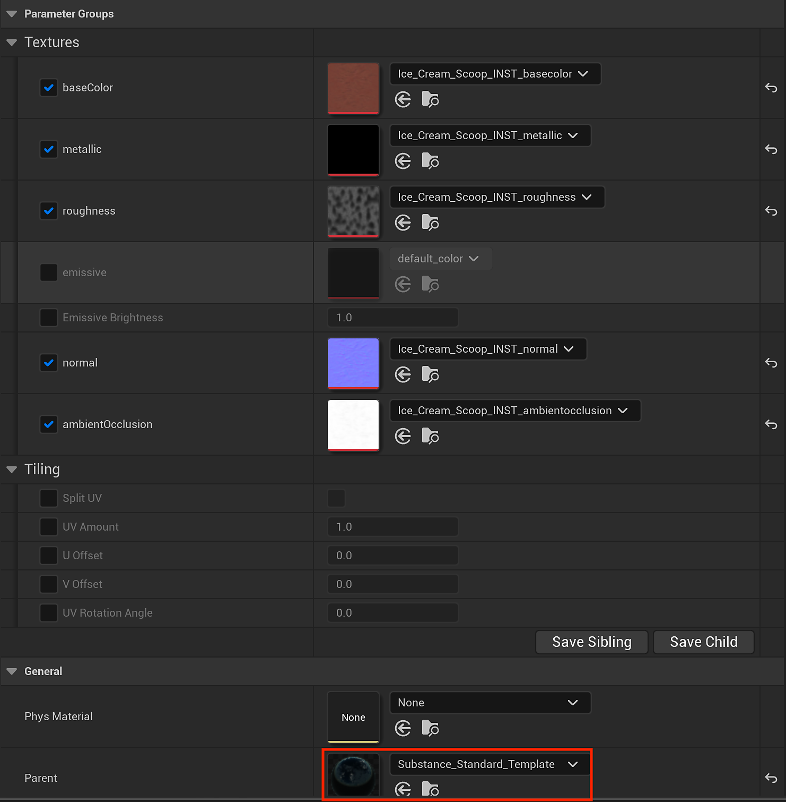
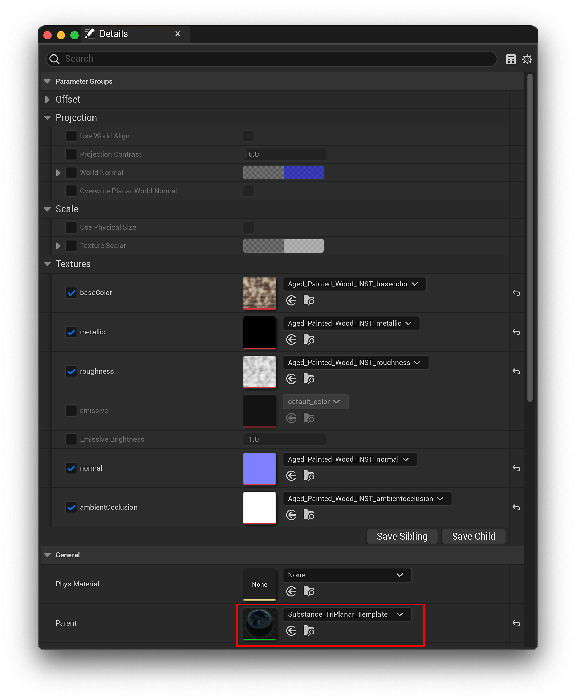
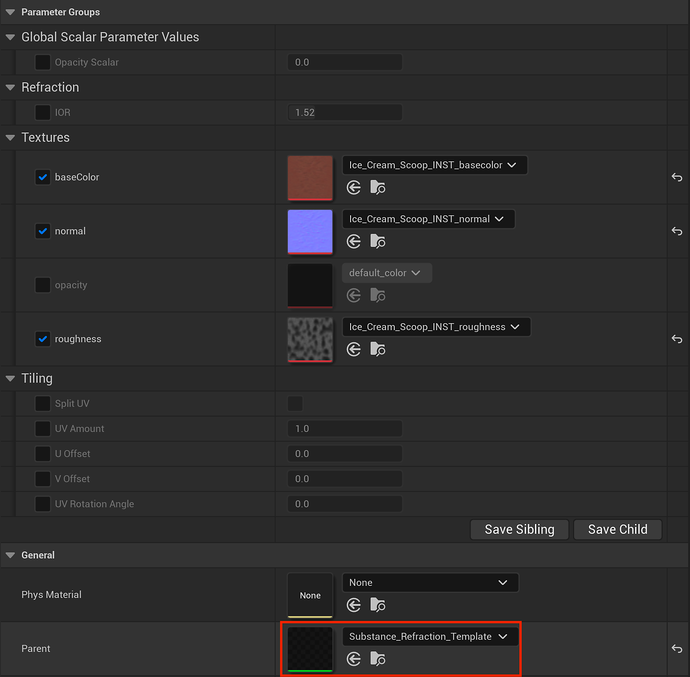
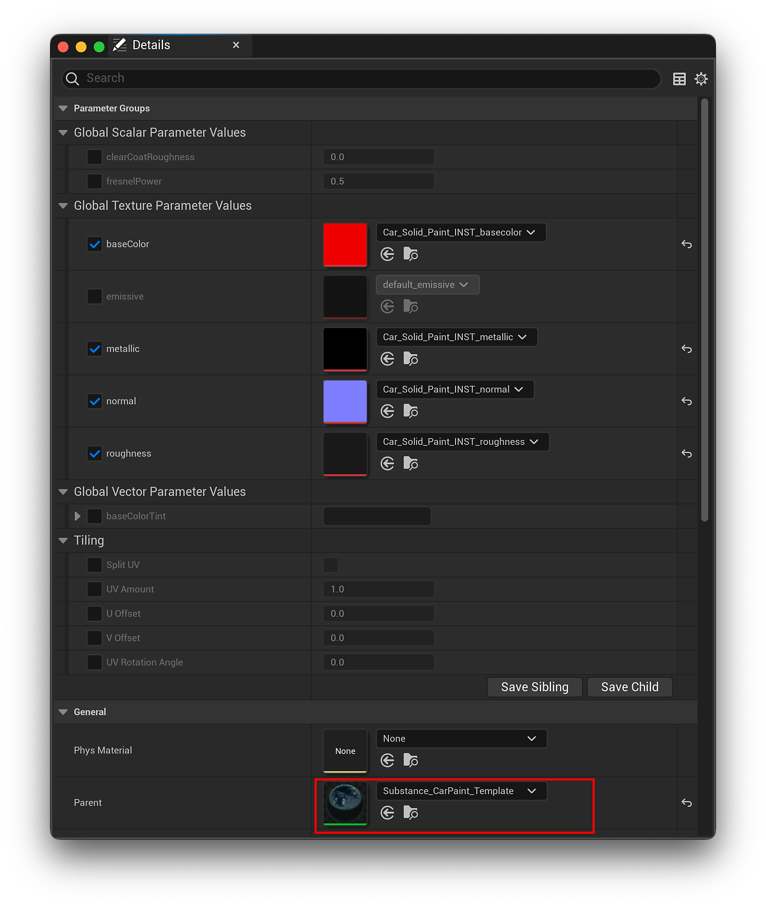
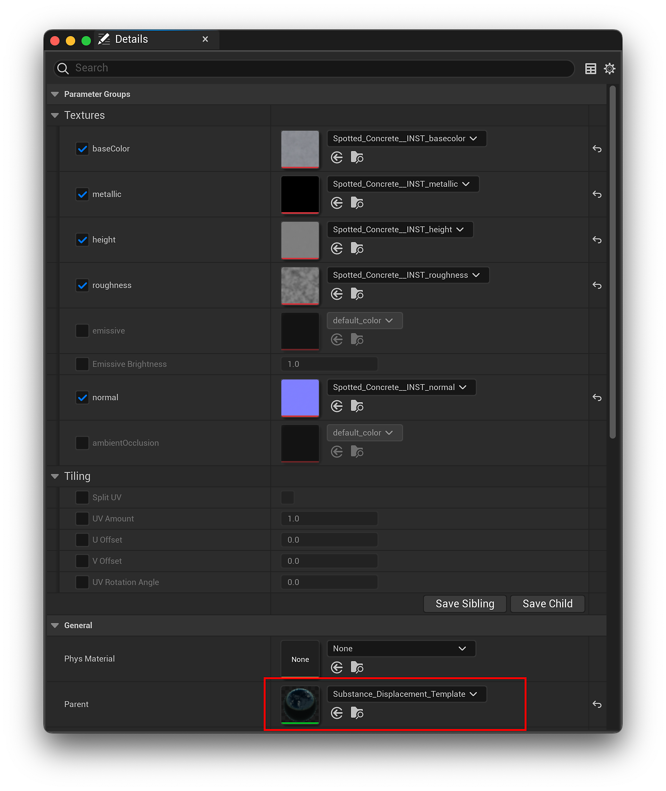
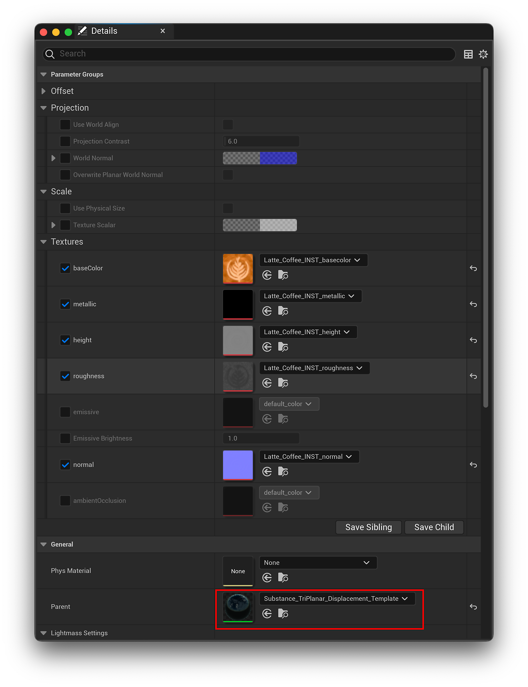

# Out-of-the-Box Material Templates

When importing SBSAR materials into the content browser, you can choose the different material templates in the drop down that are available out-of-the-box.

## Substance Standard Template

This is a basic material template for a generic UV experience. It provides some basic controls of UV amounts so you can scale the UVs to stretch textures. You can split the UV scaling by enabling the split UV option, you also have U amount, V amount, UV offset, and a UV rotation angle. This allows you to do some UV tiling as well as UV rotation.

## Substance Triplanar Template

The tirplanar template does a triplanar mapping of the X, Y, and Z angles or faces of the mesh so it blends together three different projections of the textures to seamlessly blend the angles. Triplanar template allows materials to blend together across the different faces as the object bends

The triplanar template has physical size support, so when physical size is enabled, the triplanar template scales the images based on the physical size of the material, so no matter how much you scale your object, that texture will always remain the same and have a uniform look. Learn more Physical Size here: [Physical Size - UE5](../../physical-size-ue5/physical-size-ue5.md)

## Substance Refraction Template

The refraction template is mainly used for transparent objects, for example, glasses. It allows you to modify the IOR value or standard textures that you would have for a glass material or transparent material.

## Substance Car Paint Template

The Car Paint template adds clear coat support and includes support for adjustable UV tiling and values, clear coat roughness values, and fresnel power values.

## Setting up Displacement Templates

>[!IMPORTANT]
>
> Experimental Templates
> 
> Warning: The following templates are experimental and subject to major changes between versions. These templates make use of Epic's Nanite feature, which is itself experimental as of the time of this writing. They may not be 100% stable and caution should be taken when using these in projects.

Use the following steps to fully enable Nanite displacement support in your projects and use displacement materials with your meshes.

1. Navigate to Project Folder &gt; Config &gt; DefaultEngine.ini and open it
1. Append the following to the &#91;/Script/Engine.RendererSettings&#93; section:
   * r.Nanite.AllowTessellation=1
   * r.Nanite.Tessellation=1
1. Select the static mesh you'd like to apply a displacement template to and open it's settings.
1. Toggle on the Enable Nanite Support option.
1. Import the desired .sbsar into the content browser and select either the Substance\_Displaceent\_Template or the Susbtance\_Triplanar\_Displacement\_Template
1. To change the amount of displacement, navigate to the material template and select the output node. Then, adjust the Magnitude under the Displacement section.

## Substance Displacement Template

Similar to the Substance Standard Template, this template allows for the adjustment of U and V values while adding Nanite Displacement support.

## Substance Triplanar Displacement Template

Similar to the Substance Displacement Template, this template applies triplanar projection with the option of Physical Size support with the addition of Nanite Displacement support.

