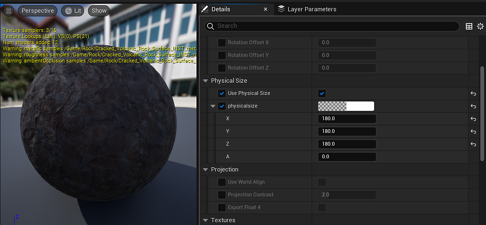

# Physical Size - UE5

Physical Size in Substance materials allows materials to be scaled based on their size in the world. This value is set in Substance Designer and read into Unreal through the material template system.   
The [Substance\_Triplanar\_Template](../material-template-usage/out-the-box-material-tem/out-of-the-box-material-templates.md) material in the parent contains an example of how physical size can be used to scale Unreal materials.

  

Regardless of the upscaling values on the mesh, the materials will tile based on the size they take up in the world in centimeters. In the case of the rock material (picture 1), this is 1.8m (180cm) for each measurement.

Substance materials containing physical size data will have their values copied into any existing material vector parameter node named physicalsize.

  

As there is no displacement value in materials in UE5, the physical size template copies the value as X, Y, X for the triplanar map.
