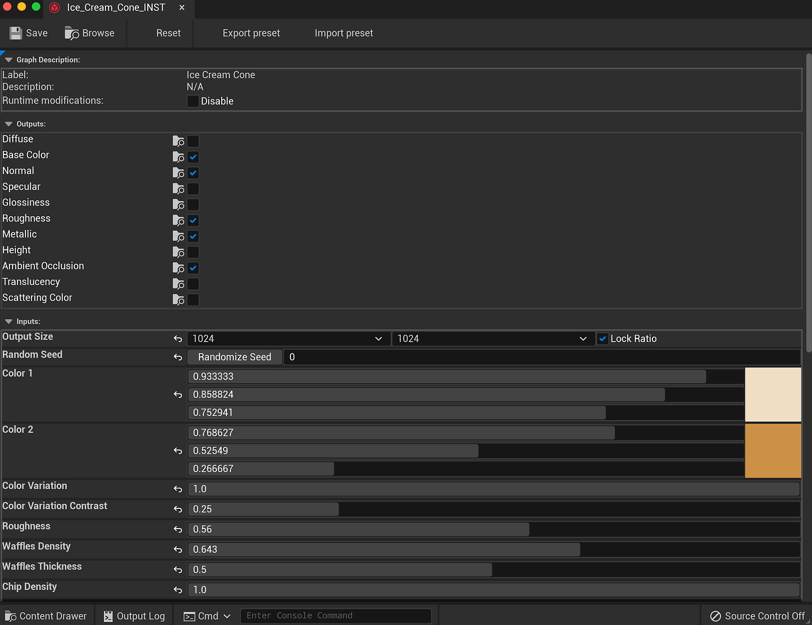

# Plugin Overview - UE5

## Importing a Substance

1. In the Content Browser, click the Import Button and browse for the Substance .sbsar file.
1. In the Substance Import options, you can set the INST and Material name that will be created. The import will create a Substance INST and Factory along with the generated textures. A UE4 material will be created with the Substance textures as input to the material channels.

## Changing Parameters

1. Double-click the Substance INST item to open the Parameters window.
1. The Reset button will reset the substance parameters to default. The Export and Import preset will export a Substance Preset file (.sbspr) using the values set in the editor. You can import a preset as well.
1. In the Outputs, you can disable and enable outputs which generate textures.
1. Output size will allow you to change the texture size.
1. Random Seed will change the seed value to generate the textures. This is good for randomizing materials.
1. The Parameters section allows you to tweak the material.

