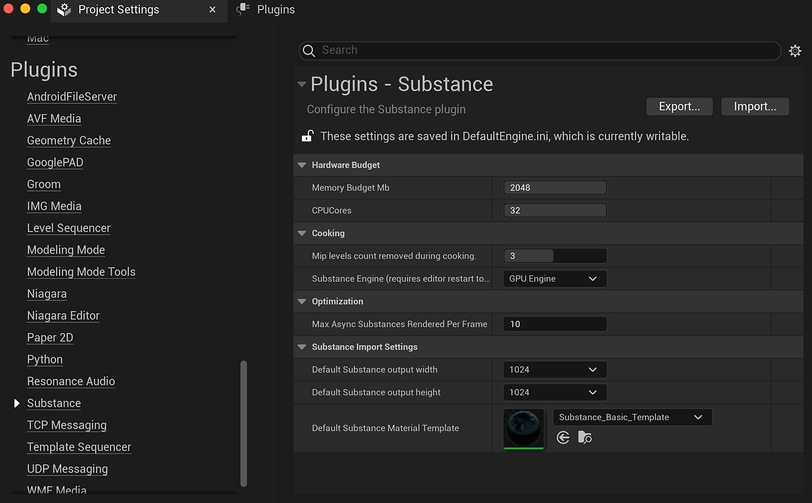

# Plugin Settings - UE5

To access the settings, go to Edit&gt;Project Settings and scroll down to the Plugins category and click on Substance.

## Hardware Budget

The memory budget is the max amount of memory to use for the Substance engine. Can be increased to improve speed of Substance processing but will consume more system resources. (Not always a helpful increase at a project level).

CPU Cores determines how many cores the Substance engine is allowed to use. This includes both physical cores and hyper threads. (If the number assigned is greater than the available cores on a system, this will default to using all available.

## Cooking

Mip Level count removed during cooking will alter how textures are created for a package. This setting can greatly improve load times and reduce package size because the larger texture mip levels will no longer need to be loaded. The lower resolution / smaller LOD's will be loaded and the highest will be defaulted by UE5. The Substances are then processed through the Substance engine and updated at run time with the high resolution LODs.

The Substance Engine can be CPU or GPU. The GPU engine will allow you to create 4K textures. The CPU engine is capped at 2K.

## Optimization:

This limits how many async substances can be passed to the substance engine each batch. Lower numbers will speed up how quickly an async task will complete and be updated where higher numbers will batch renders and process multiple Substances at a time. (The higher the number, the more choppy texture updates become because the time in between the updates is longer).

## Async/Sync Rendering

Sync rendering is a blocking rendering call. This will pass a Substance graph instance to the Substance engine to be recomputed but it will stop execution until the Substance engine has finished processing the Substance before continuing on to any further code execution. The result will also be updated on your screen as soon as the process has finished.

Async will add your graph to a queue and send multiple graphs to the Substance engine at a time (set from within Substance settings) within the plugin update. Unlike sync rendering, as soon as they are sent off, the program keeps running like usual instead of waiting around for the Substance engine to be complete. When the Substance engine has finished that batch, it sends the results back, we apply them to the outputs, and we kick off another batch.
