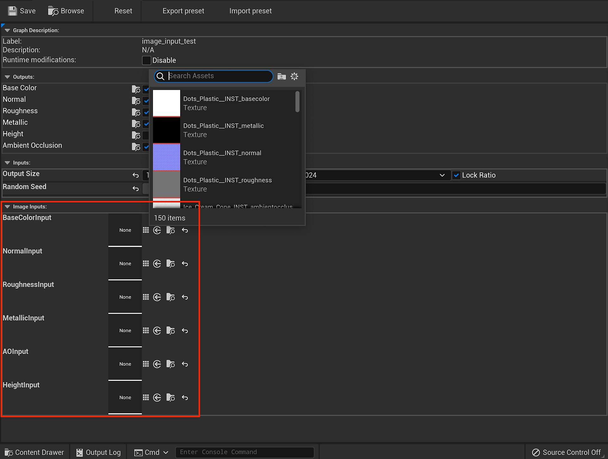

# Substance Input Image - UE5

Substances can be created with inputs where you can supply an image for processing in the material. This allows you to create modular materials that can take baked mesh data or patterns as input to change or confirm the material to the asset.

* You can use UTexture2D with a Substance input.

