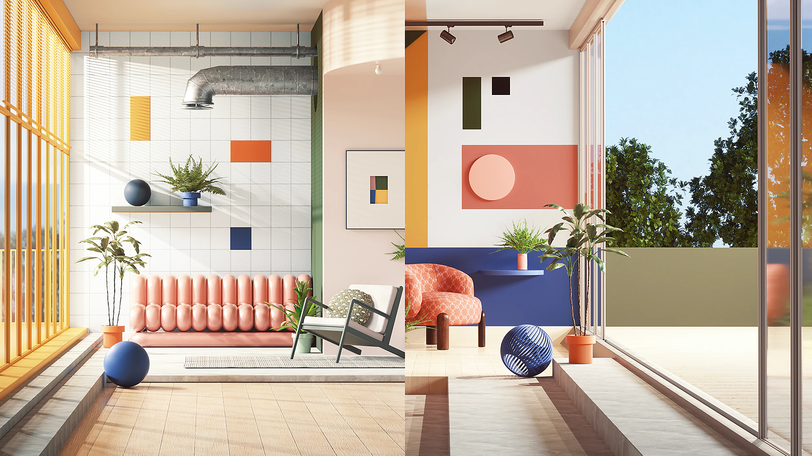

# Adobe Substance 3D and Maxon One

Adobe has partnered with Maxon to offer the awesome 3D design and visualization tools of Substance 3D and Maxon One in a single package.

Artist: Peter Tarka

When it comes to 3D design and visualization, Maxon One and Adobe Substance 3D together offer a range of remarkable benefits. Maxon One provides a suite of creative tools, including Cinema 4D, Forger, Red Giant, Redshift, Universe, and ZBrush, along with the growing collection of Capsules assets. Adobe Substance 3D empowers artists with tools like Modeler, Sampler, Designer, Painter, Stager, and provides access to the huge Assets library. Combining these industry-leading software packages streamlines workflows, enhances productivity, and enables the creation of stunning visuals and immersive experiences.

## A single purchase with huge value

The Maxon One and Substance 3D bundle is available for purchase on [Maxon's website](https://www.maxon.net/en/). The bundle includes:

* All the tools in Maxon One.
* All the tools in the Adobe Substance 3D Collection.
* Access to Maxon and Adobe Training.

More information is available in [the FAQ](faq/faq.md) or on [Maxon's website](https://www.maxon.net/en/).
