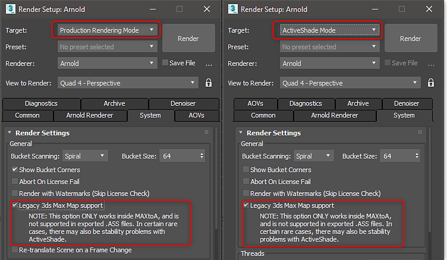

# Arnold - Substance in 3ds Max

>[!NOTE]
>
> You need enable Legacy 3ds Max Map support for Substance textures to work with Arnold

## Substance in 3ds Max Plugin

Using the[ 3ds Max plugin](../../../3d-applications/3ds-max/3ds-max.md), you can choose Arnold in the Substance menu to automatically setup the Arnold material with Substance texture inputs.

## Legacy Map Support

Legacy map support needs to be enabled for Production and ActiveShade renders.

>[!WARNING]
>
> The GPU renderer is not support with Substance Textures when using ActiveShade.

 