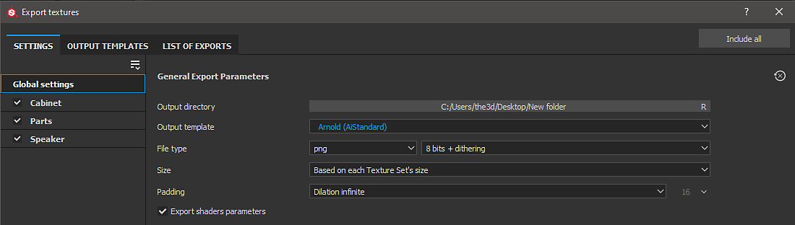

# Arnold - Substance Painter

Substance Painter 2020.1 (6.1.0) ships with [Output Templates](https://helpx.adobe.com/substance-3d-painter/getting-started/export/export-presets.html) for Arnold using the [aiStandard material](https://docs.arnoldrenderer.com/display/A5AFMUG/Standard+Surface).

{width="800px"}

## Arnold Standard Shader (Arnold 5 and higher)

| Substance Painter Export | Arnold AiStandardSurface |
| --- | --- |
| BaseColor | Base / Color |
| Roughness | Specular / Roughness |
| Metalness | Base / Metalness |
| Normal | (**Maya**) Geometry/ Bump Mapping / bump2d (Use as Tangent Space Normals) (**3ds** **Max**) Bitmap → Normal |
| Height | (**Maya**) Displacement Shader / displacement (**3ds** **Max**) Object modifier → Arnold Properties → Displacement → Use Map |
| Emissive | Emission/ Color (Emission Weight = 1.0) |
| Anisotropy Level (not included in default Arnold Output template) | (**Maya**) Coat/ Anisotropy (**3ds** **Max**) Coat/ Anisotropy |
| Anisotropy Level (not included in default Arnold Output template) | (**Maya**) Coat/ Rotation (**3ds** **Max**) Coat/ Rotation |

>[!NOTE]
>
> Maps that represent data will need to be interpreted correctly. Please see the [Color Management ](../../color-management/color-management.md)page for more information.
