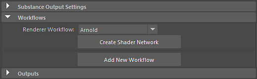

# Arnold - Substance in Maya

## Substance in Maya Plugin

You can use the Arnold[ Render Workflow](../../../3d-applications/maya/using-workflows/using-workflows.md) to automatically create a shader network.

